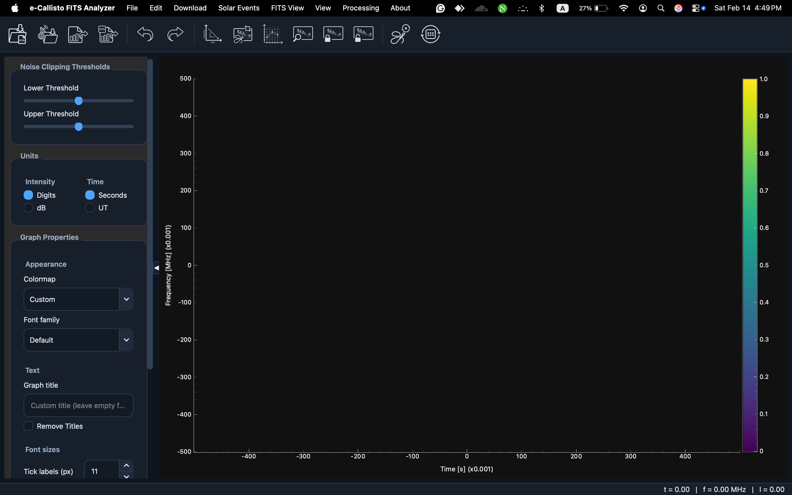
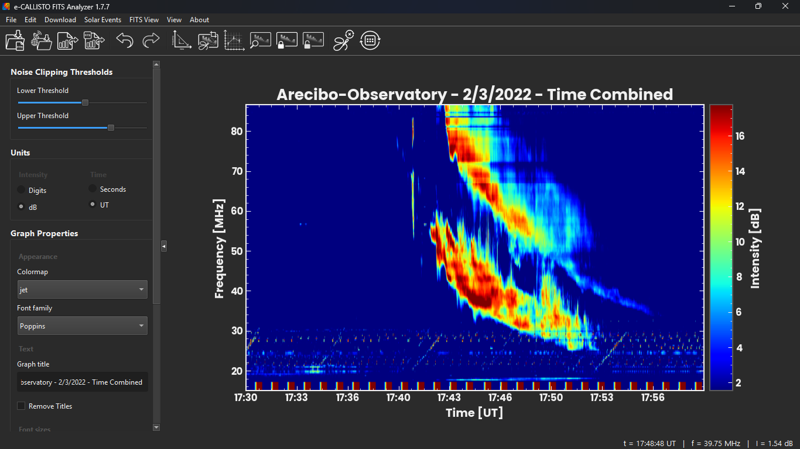
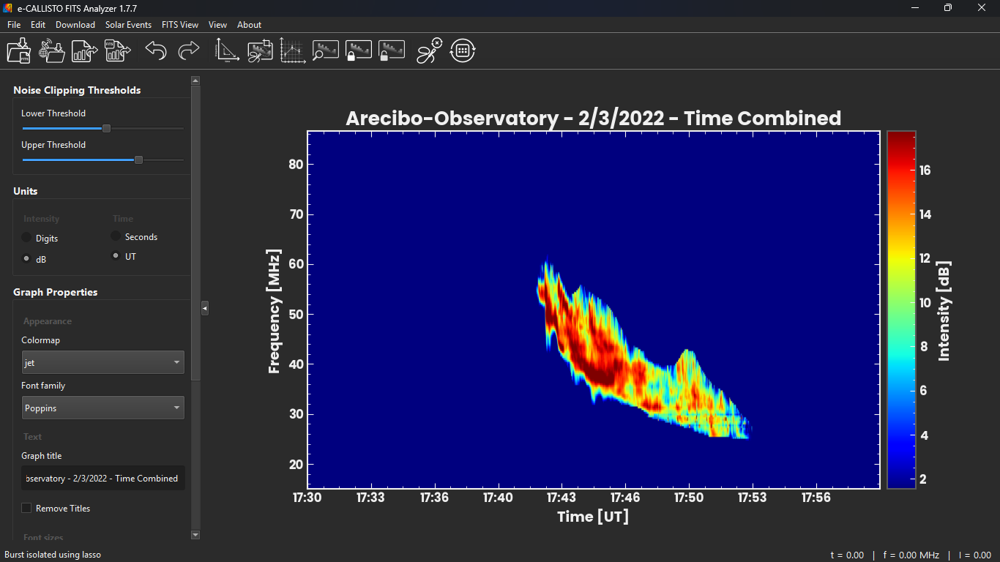
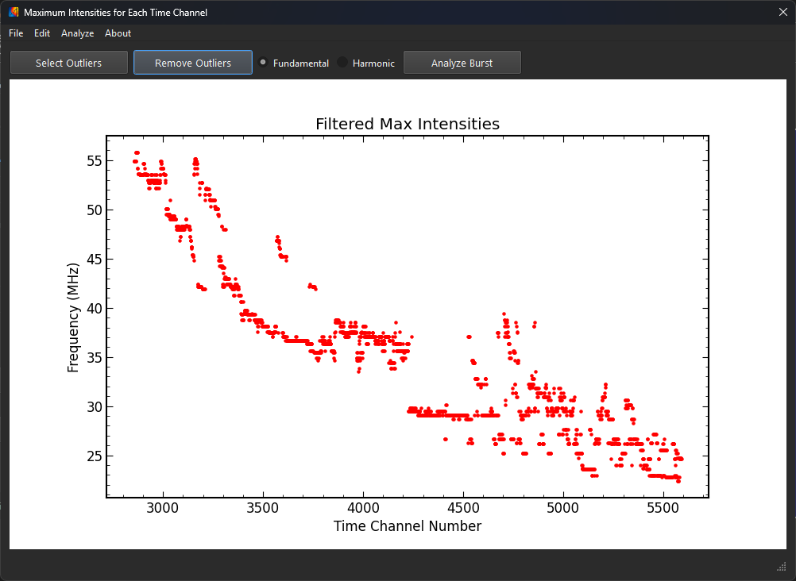
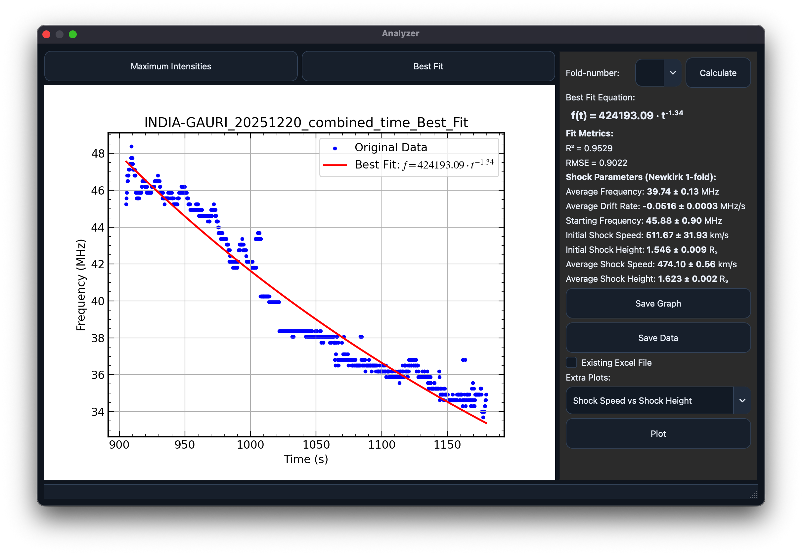
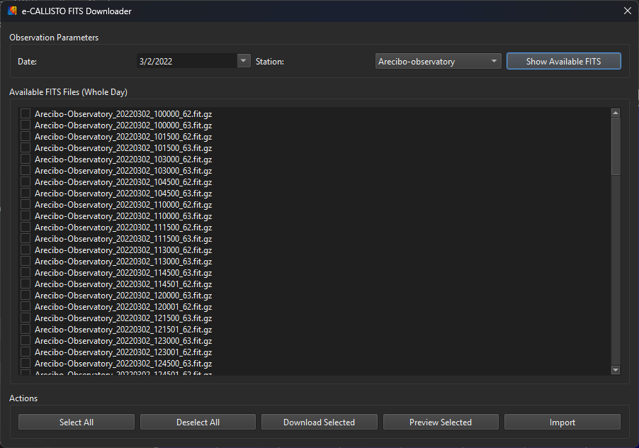

# e-CALLISTO FITS Analyzer
A desktop application for visualizing, processing, and analyzing e-CALLISTO solar radio FITS data.

Current stable release: **2.0**  
Upcoming version: **2.1** *(in development)*

---

## 🚧 Upcoming Features (v2.1 - In Development)

The items below are in-progress for **v2.1** and are not yet a final public release.

### Planned application updates
- **Batch FIT Processing window**: **Processing → Batch Processing → Open Batch Processor** for folder-based batch export.
- **Batch output controls**: choose **Raw** or **Background Subtracted** PNG output.
- **Background subtraction options**: select **Mean** or **Median** subtraction for batch processing.
- **Batch visualization controls**: select colormap per batch run; output PNGs use **UT** on the x-axis and **dB** on the colorbar.
- **Batch progress + resilience**: progress bar, per-file continue-on-error behavior, and end-of-run summary.
- **Report a Bug workflow**: **About → Report a Bug...** with diagnostics ZIP generation and prefilled GitHub issue draft.
- **Update Checker**: **About → Check for Updates...** to search online for newer releases.
- **Background update checks**: checks run without blocking the UI.
- **In-app update download flow**: download installer/package inside the app with progress and cancel support, plus release page link.
- **Autosave + crash recovery**: rolling recovery snapshots with **File → Recover Last Session...**.
- **RFI cleaning toolkit**: median filtering, robust channel masking, percentile clip with preview/apply/reset workflow.
- **Annotation layer**: polygon/line/text annotations persisted in project files.
- **Cross-panel time sync**: sync active analyzer time window to GOES/CME windows.
- **Processing presets**: save/apply/delete named presets (global + project snapshot support).
- **Provenance report export**: one-click Markdown + JSON metadata reports for reproducibility.

### Planned CME viewer enhancements
- **Enhanced CME Viewer** with a more stable, isolated playback flow.
- Improved interactive CME playback for running-difference movies with GOES X-ray context.
- Better failure handling and fallback behavior to avoid main-window crashes.

### v2.0 highlights

### Core workflow
- Added **session/project save and load** support (`.efaproj`) to restore analysis state.
- Introduced a unified, more robust FITS I/O layer across loading/downloading/combining workflows.
- Improved FITS parsing for `.fit`, `.fits`, `.fit.gz`, `.fits.gz`, swapped axes, and missing/alternate axis tables.
- Added **FITS View → View FITS Header** with header inspection and save-to-`.txt`.
- Combined datasets now carry updated header metadata for time/frequency merge context.

### Analysis and plotting
- Fixed Best-Fit/Analyzer crash (`TypeError: cannot unpack non-iterable bool object`) in shock parameter workflows.
- Dynamic spectrum titles are now context-aware (`filename-Raw`, `filename-Background Subtracted`) and no longer use `Dynamic Spectrum`.
- Short-duration time windows now show `hh:mm:ss` for better readability.
- Fixed undo/reset-view behavior after zooming so actions stay enabled and functional.
- Added **Edit → Reset to Raw** to restore raw data view and reset clipping sliders to `0`.

### Export and compatibility
- Improved exported FITS compatibility with external tools (including JavaViewer) for combined files.
- Added export `BITPIX` control (`Auto`, `8`, `16`, `32`) and removed problematic float64 export behavior.
- FITS export now reuses source FITS structure for combined output to preserve axis-table compatibility.
- Default export filenames (image + FITS) now follow the active graph title and avoid duplicated combine suffixes.

### UI/UX
- Added a **collapsible left sidebar**.
- When collapsed, the graph area expands to use the full available width.
- Added **View → Mode** with **Classic** and **Modern** UI modes.
- Modern mode is now applied consistently across main and auxiliary windows.
- Improved modern sidebar layout spacing for cleaner section grouping.
- Fixed modern-mode **combo box** and **spin box** arrow visibility/styling.

### Build and packaging reliability
- Updated platform build configs for v2.0 UI assets and modern theme resources.
- Aligned PyInstaller and py2app manifests so all icon packs are bundled consistently.

---

## 📘 User Guide

This guide explains how to use the main features of the **e-CALLISTO FITS Analyzer**, including dynamic spectrum visualization, live noise reduction, burst isolation, drift estimation, maximum intensity extraction, best-fit analysis, FITS export, the FITS downloader, and the built-in CME and GOES modules.

---

# 1. Main Interface

After launching the application, the main window opens with tools for loading FITS files, adjusting thresholds, selecting colormaps, isolating bursts, navigating the spectrum, and performing scientific analysis.

The main functions are available through a compact **icon toolbar** for quick access and a clean layout.

### **Main Window**

---

# 2. Loading a FITS File

You can load:

- **Compressed FITS:** `*.fit.gz`, `*.fits.gz`
- **Uncompressed FITS:** `*.fit`, `*.fits`

This supports observers who work directly with uncompressed raw data.

Choose **File → Open** or click the **Open** icon on the toolbar.  
The dynamic spectrum appears immediately.

---

# 3. Noise Reduction (Live Threshold Scrollbars)

Noise reduction updates **live** without pressing Apply.

Features:

- Two wide horizontal scrollbars for lower and upper clipping thresholds (Vmin / Vmax)
- Labels repositioned for clearer visual feedback
- Dynamic spectrum refreshes automatically
- No data are lost when switching x-axis units (seconds ↔ UT)

### Example: Noise Reduction

---

# 4. Intensity Scale and Units

The color-bar (z-axis) provides clearer physical meaning.

Features:

- Explicit intensity labeling on the color-bar
- Unit selector for:
  - **Digits / ADU**
  - **Optional dB scaling**
- Unit changes update the display immediately

This improves interpretability across different observing stations.

---

# 5. Colormap Selection

The **Colormap** panel allows choosing from several scientifically useful palettes:

- Custom (blue–red–yellow)
- Viridis
- Plasma
- Inferno
- Magma
- Cividis
- Turbo
- RdYlBu
- Jet
- Cubehelix

The plot updates as soon as a colormap is selected.

---

# 6. Graph Properties Panel

A **Graph Properties** panel is included to adjust plot appearance from one place.

Typical use cases:

- Update titles and labels for exports
- Adjust plot styling for clearer presentation
- Keep visual settings consistent across plots

---

# 7. Navigation: Zoom and Pan

Interactive navigation is available in the dynamic spectrum.

Features:

- **Scroll wheel:** Zoom in and out
- **Click + drag:** Pan across time and frequency
- Navigation works alongside noise reduction and colormap changes

This allows precise inspection of fine spectral structures.

---

# 8. Cursor Data Display

When moving the mouse cursor over the plot area, the status bar displays:

- Time
- Frequency
- Intensity value (in selected units)

This enables quick quantitative inspection without additional clicks.

---

# 9. Burst Isolation (Lasso Tool)

Click **Isolate Burst** and draw around the emission region.  
Only the selected region is retained for further analysis.

### Example: Isolated Burst

---

# 10. Maximum Intensities Extraction

Click **Plot Maximum Intensities** to compute the maximum frequency for each time channel after noise reduction or burst isolation.

### Example: Maximum Intensities

---

# 11. Outlier Removal

Inside the Maximum Intensities window:

- Draw a lasso to select outliers
- Remove them instantly
- Prepare the cleaned curve for fitting

---

# 12. Burst Analyzer (Best Fit & Shock Parameters)

The Analyzer window performs:

- Power-law fitting of the Type II backbone
- Drift-rate evaluation
- Shock speed
- Shock height
- R² and RMSE

Newkirk model option:

- **Newkirk fold number** can be selected as:
  - **1, 2, 3, 4**

Optional additional plots:

- Shock speed vs height
- Shock speed vs frequency
- Height vs frequency

### Example: Analyzer

Export options:

- Best-fit graph (PNG, PDF, EPS, SVG, TIFF)
- Data summary to Excel
- Multiple additional plots

---

# 13. FITS Downloader

Open via **Download → Launch FITS Downloader**.

Features:

- Select station, date, and hour
- Fetch available files from the server
- Preview selected files
- Download multiple FITS files
- Import selected FITS files directly into the Analyzer
- Automatic detection of frequency or time stitching compatibility
- Clear error messages when selected files cannot be combined

### Example: Downloader

---

# 14. Combine FITS Files

Two combination modes are supported.

### **Combine Frequency**
Merge consecutive frequency bands when time bases match.

### **Combine Time**
Merge consecutive time segments from the same station and date.

If files do not meet the required criteria, a message box alerts the user.

Combined data can be imported directly into the Analyzer.

---

# 15. Save and Reopen Analysis Projects

You can save the full analysis state to a project file and restore it later.

Path:

- **File → Save Project**
- **File → Save Project As...**
- **File → Open Project...**

Project format:

- **e-CALLISTO Project:** `*.efaproj`

Saved state includes plot view, thresholds, units, colormap, graph properties, loaded/combined data, and analysis-session state.

---

# 16. Export Data as FITS

You can now export processed data as a new FITS file with a modified header. This is useful for downstream analysis and **Machine Learning** workflows.

Export options:

- **Raw view**
- **Background-subtracted view**
- **Combined datasets** (time/frequency) with compatibility-preserving metadata updates

Path:

- **File → Export As → Export to FIT**

---

# 17. Saving and Exporting Plots

All figures across the application can be exported in:

- PNG
- PDF
- EPS
- SVG
- TIFF

Export handling improvements:

- Export errors for PDF, EPS, and SVG formats have been resolved
- On Windows, if the default save location is restricted (for example `C:\Program Files`), the user is prompted to select an alternate folder

This supports publication workflows across operating systems.

---

# 18. CME Catalog Viewer (SOHO/LASCO)

Features:

- Retrieve daily CME lists
- Display CME parameters in a structured table
- Show associated LASCO movies
- Event metadata panel

### Example: CME Viewer

---

# 19. GOES X-Ray Flux Viewer

Features:

- View GOES-16 / GOES-18 X-ray light curves
- Select short or long channels
- Adjust time windows
- Extract flare parameters
- Export plots and data

### Example: GOES X-Ray Viewer

---

## 20. Check for Updates

Use **About → Check for Updates...** to query the latest release from GitHub.

- If a newer version is available, the app shows current/latest versions and a direct download action.
- Downloads run in-app and save the installer/package to your selected location.
- If you are up to date, the app confirms your current version.
- If the check fails (for example, no network), the app shows a clear error message.

---

## 🛠️ Build and Packaging (v2.1)

### Prerequisites
- Python 3.10+ (recommended: same version used for your target build machine)

### Run from Source (development)
- Create and activate a virtual environment.
- Install dependencies:
  - `python src/Installation/install_requirements.py`
- Start the app:
  - `python src/UI/main.py`

### Build dependencies
- Install runtime dependencies:
  - `python src/Installation/install_requirements.py`
- Install build tooling:
  - `python -m pip install pyinstaller pyinstaller-hooks-contrib`
  - macOS only: `python -m pip install py2app`

### Windows (PyInstaller + optional Inno Setup installer)
- Recommended scripted build:
  - `powershell -ExecutionPolicy Bypass -File .\src\Installation\build_windows_installer.ps1`
- Optional app-folder-only build:
  - `powershell -ExecutionPolicy Bypass -File .\src\Installation\build_windows_installer.ps1 -SkipInstaller`
- Manual installer script:
  - `src/Installation/FITS_Analyzer_InnoSetup.iss`

### Linux (.deb + PyInstaller)
- Recommended `.deb` packaging workflow:
  - `bash src/Installation/build_deb_linux.sh`
- Manual PyInstaller build:
  - `pyinstaller src/Installation/FITS_Analyzer_linux.spec`

### macOS (py2app)
- Build app bundle:
  - `python src/Installation/setup.py py2app`

### Generic cross-platform spec
- Alternative build entry:
  - `pyinstaller src/Installation/FITS_Analyzer.spec`

---

## 📄 Notes

- Supports `.fit`, `.fits`, `.fit.gz`, and `.fits.gz`
- Project save/load format: `.efaproj`
- Live noise reduction with preserved zoom, pan, and axis format
- Cursor-based data readout for time, frequency, and intensity
- Improved plotting area for clearer scientific visualization
- Robust export system with OS-aware save handling
- Major plots are publication ready
- Linux fallback for problematic GPU stacks: `CALLISTO_FORCE_SOFTWARE_OPENGL=1`

---

## ⭐ Credits

Developed by **Sahan S. Liyanage**  
Astronomical and Space Science Unit  
University of Colombo, Sri Lanka
