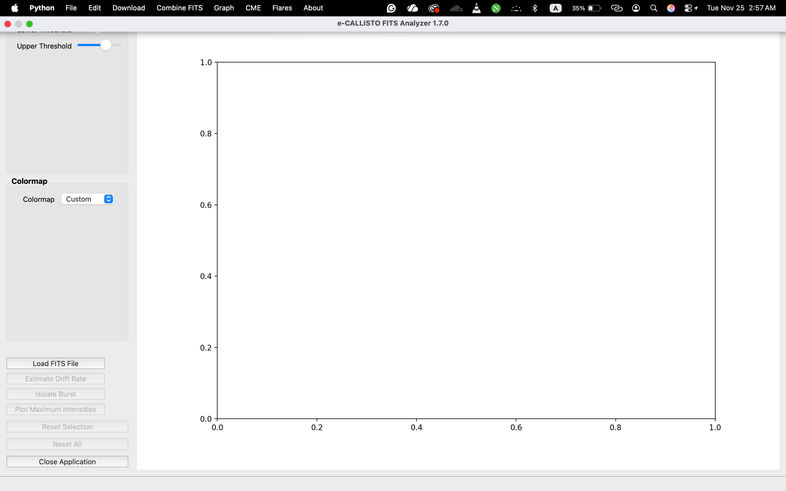
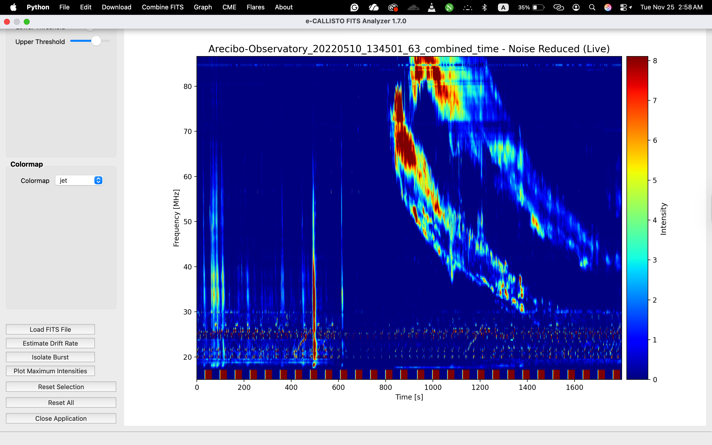
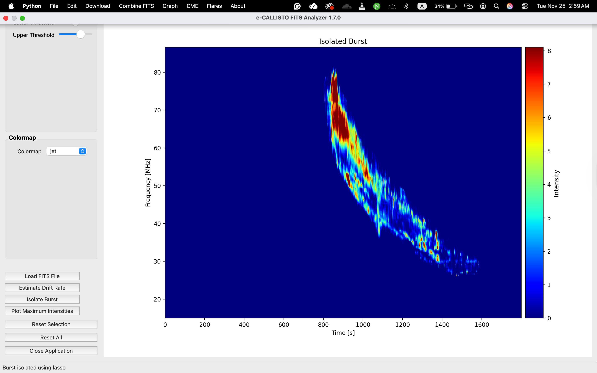
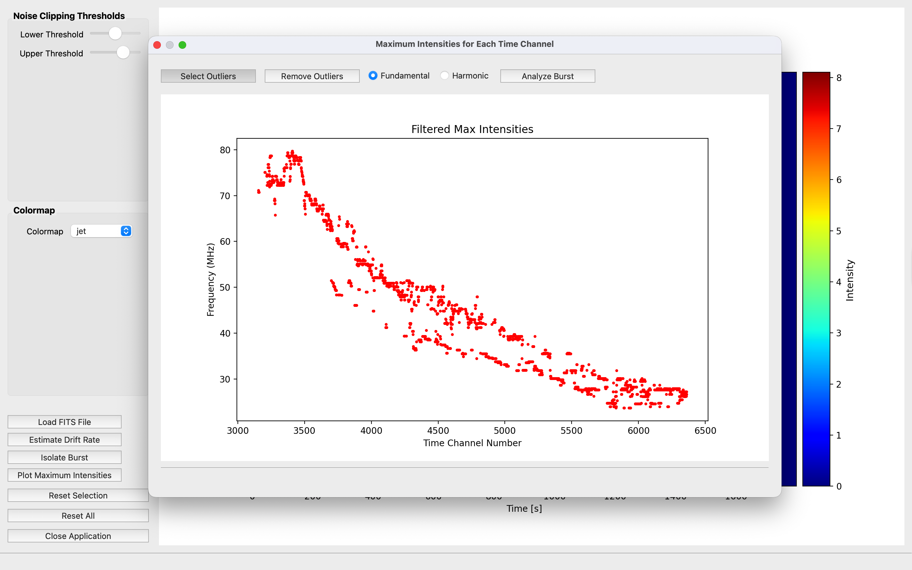
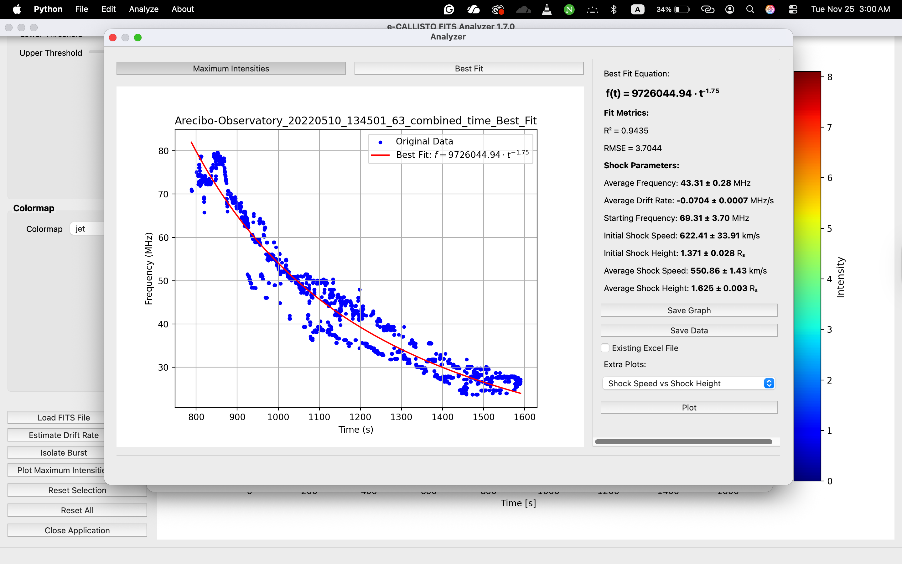
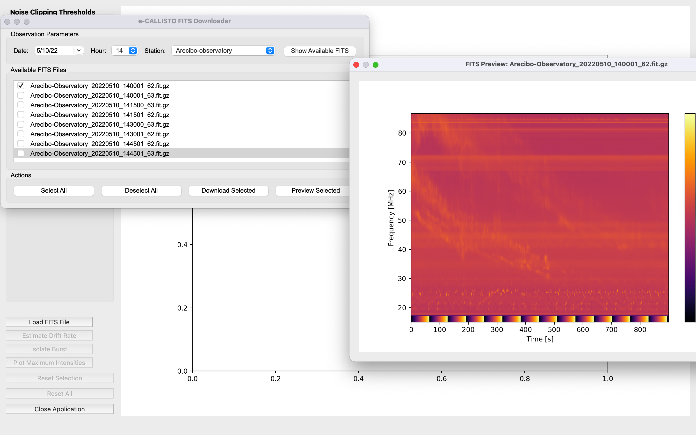
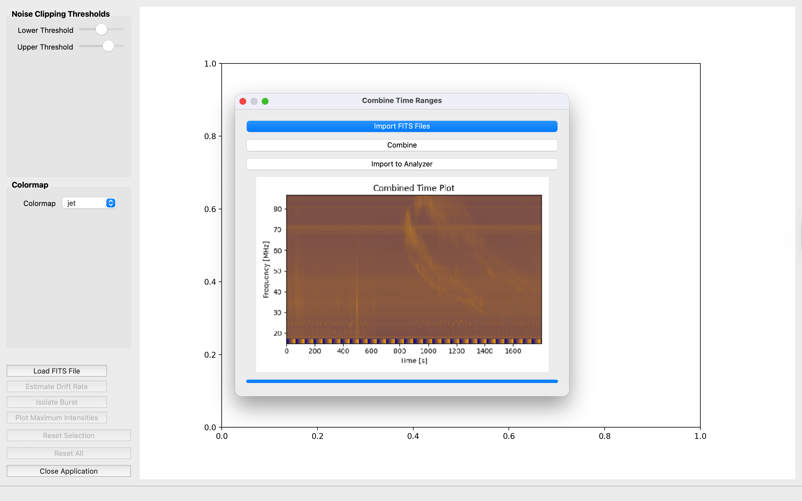
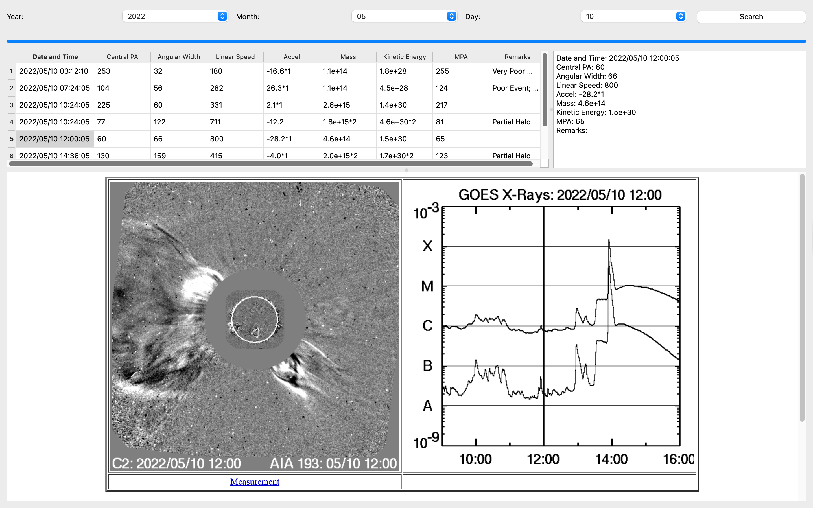
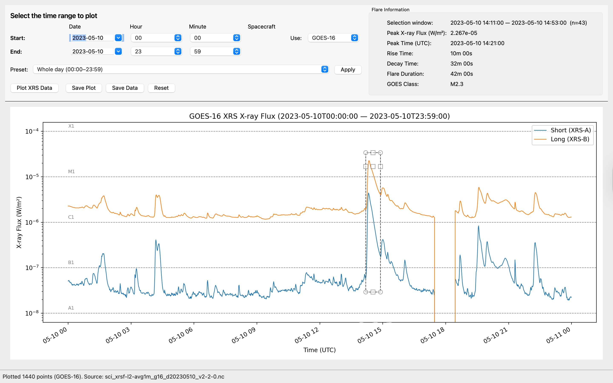

# e-CALLISTO FITS Analyzer  
A desktop application for visualizing, processing, and analyzing e-CALLISTO solar radio FITS data.

Version **1.7.3**

---

## 📘 User Guide

This guide explains how to use the main features of the **e-CALLISTO FITS Analyzer**, including dynamic spectrum visualization, live noise reduction, burst isolation, drift estimation, maximum intensity extraction, best-fit analysis, the FITS downloader, and the built-in CME and GOES modules.

---

# 1. Main Interface

After launching the application, the main window opens with tools for loading FITS files, adjusting thresholds, selecting colormaps, isolating bursts, navigating the spectrum, and performing scientific analysis.

### **Main Window**

---

# 2. Loading a FITS File

You can load:

- **Compressed FITS:** `*.fit.gz`  
- **Uncompressed FITS:** `*.fit`

This supports observers who work directly with uncompressed raw data.

Choose **File → Open** or click **Load FITS File**.  
The dynamic spectrum appears immediately.

---

# 3. Noise Reduction (Live Threshold Scrollbars)

Noise reduction updates **live** without pressing Apply.

Features:

- Two wide horizontal scrollbars for lower and upper clipping thresholds (Vmin / Vmax)  
- Labels repositioned for clearer visual feedback  
- Dynamic spectrum refreshes automatically  
- No data are lost when switching x-axis units (seconds ↔ UT)

### Example: Noise Reduction  

---

# 4. Intensity Scale and Units

The color-bar (z-axis) now provides clearer physical meaning.

Features:

- Explicit intensity labeling on the color-bar  
- Unit selector for:
  - **Digits / ADU**
  - **Optional dB scaling**
- Unit changes update the display immediately

This improves interpretability across different observing stations.

---

# 5. Colormap Selection

The **Colormap** panel allows choosing from several scientifically useful palettes:

- Custom (blue–red–yellow)
- Viridis  
- Plasma  
- Inferno  
- Magma  
- Cividis  
- Turbo  
- RdYlBu  
- Jet  
- Cubehelix  

The plot updates as soon as a colormap is selected.

---

# 6. Navigation: Zoom and Pan

Interactive navigation has been added to the dynamic spectrum.

Features:

- **Scroll wheel:** Zoom in and out  
- **Click + drag:** Pan across time and frequency  
- Navigation works alongside noise reduction and colormap changes

This allows precise inspection of fine spectral structures.

---

# 7. Cursor Data Display

When moving the mouse cursor over the plot area, the status bar displays:

- Time  
- Frequency  
- Intensity value (in selected units)

This enables quick quantitative inspection without additional clicks.

---

# 8. Burst Isolation (Lasso Tool)

Click **Isolate Burst** and draw around the emission region.  
Only the selected region is retained for further analysis.

### Example: Isolated Burst  

---

# 9. Maximum Intensities Extraction

Click **Plot Maximum Intensities** to compute the maximum frequency for each time channel after noise reduction or burst isolation.

### Example: Maximum Intensities  

---

# 10. Outlier Removal

Inside the Maximum Intensities window:

- Draw a lasso to select outliers  
- Remove them instantly  
- Prepare the cleaned curve for fitting

---

# 11. Burst Analyzer (Best Fit & Shock Parameters)

The Analyzer window performs:

- Power-law fitting of the Type II backbone  
- Drift-rate evaluation  
- Shock speed  
- Shock height  
- R² and RMSE  

Optional additional plots:

- Shock speed vs height  
- Shock speed vs frequency  
- Height vs frequency  

### Example: Analyzer  

Export options:

- Best-fit graph (PNG, PDF, EPS, SVG, TIFF)  
- Data summary to Excel  
- Multiple additional plots  

---

# 12. FITS Downloader

Open via **Download → FITS Downloader**.

Features:

- Select station, date, and hour  
- Fetch available files from the server  
- Preview selected files  
- Download multiple FITS files  
- Import selected FITS files directly into the Analyzer  
- Automatic detection of frequency or time stitching compatibility  
- Clear error messages when selected files cannot be combined

### Example: Downloader  

---

# 13. Combine FITS Files

Two combination modes are supported.

### **Combine Frequency**
Merge consecutive frequency bands when time bases match.

### **Combine Time**
Merge consecutive time segments from the same station and date.

If files do not meet the required criteria, a message box alerts the user.

### Example: Combined Time Plot  

Combined data can be imported directly into the Analyzer.

---

# 14. Saving and Exporting Plots

All figures across the application can be exported in:

- PNG  
- PDF  
- EPS  
- SVG  
- TIFF  

Export handling improvements:

- Export errors for PDF, EPS, and SVG formats have been resolved  
- On Windows, if the default save location is restricted (e.g., `C:\Program Files`), the user is prompted to select an alternate folder

This ensures smooth operation across operating systems and publication workflows.

---

# 15. CME Catalog Viewer (SOHO/LASCO)

Features:

- Retrieve daily CME lists  
- Display CME parameters in a structured table  
- Show associated LASCO movies  
- Event metadata panel  

### Example: CME Viewer  

---

# 16. GOES X-Ray Flux Viewer

Features:

- View GOES-16 / GOES-18 X-ray light curves  
- Select short or long channels  
- Adjust time windows  
- Extract flare parameters  
- Export plots and data  

### Example: GOES X-Ray Viewer  

---

## 📄 Notes

- Supports both `.fit` and `.fit.gz` files  
- Live noise reduction with preserved zoom, pan, and axis format  
- Cursor-based data readout for time, frequency, and intensity  
- Robust export system with OS-aware save handling  
- All major plots are publication ready

---

## ⭐ Credits

Developed by **Sahan S. Liyanage**  
Astronomical and Space Science Unit  
University of Colombo, Sri Lanka
