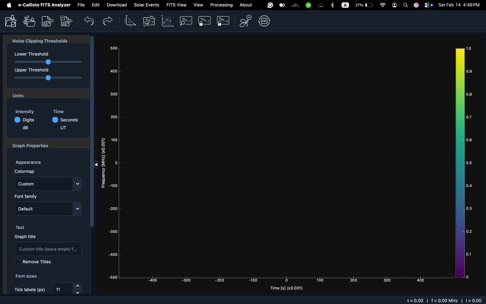
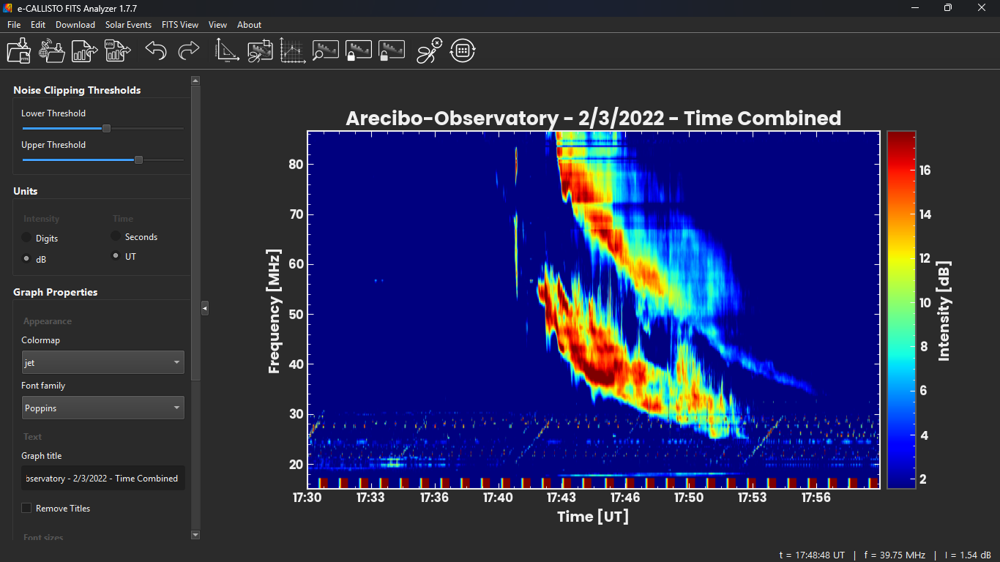
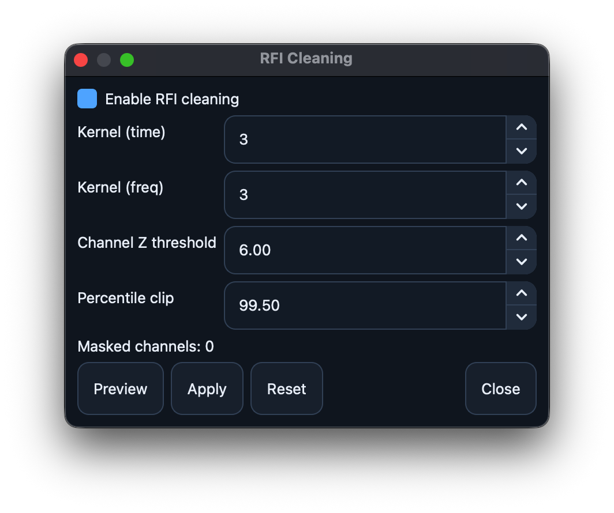
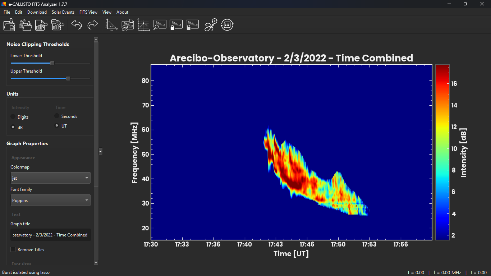
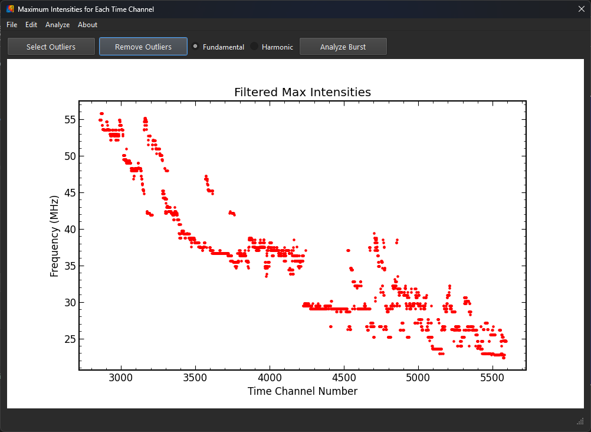
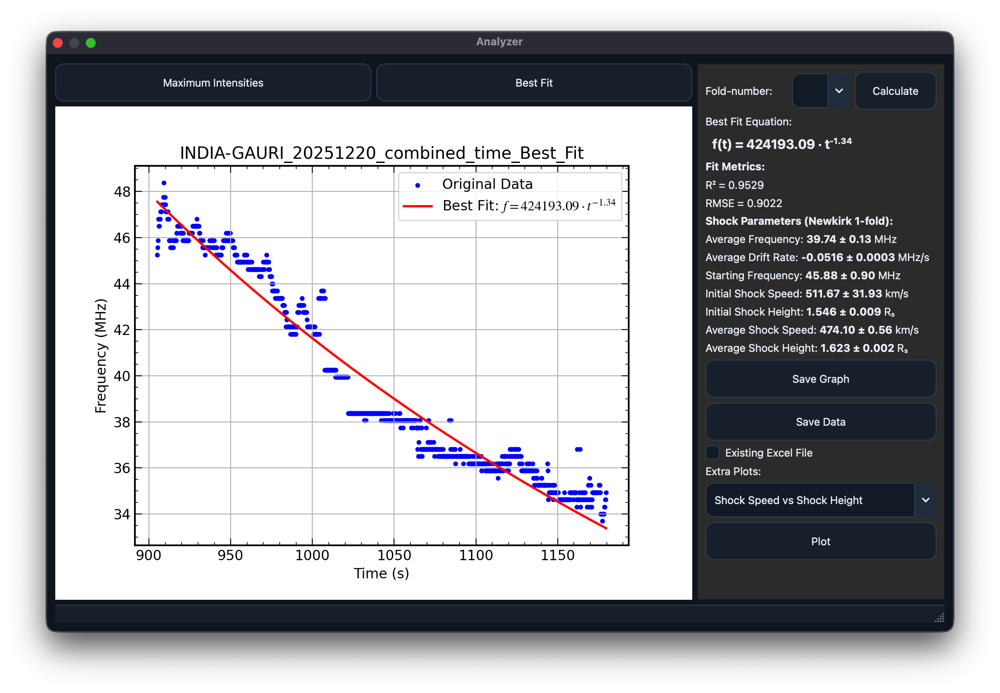
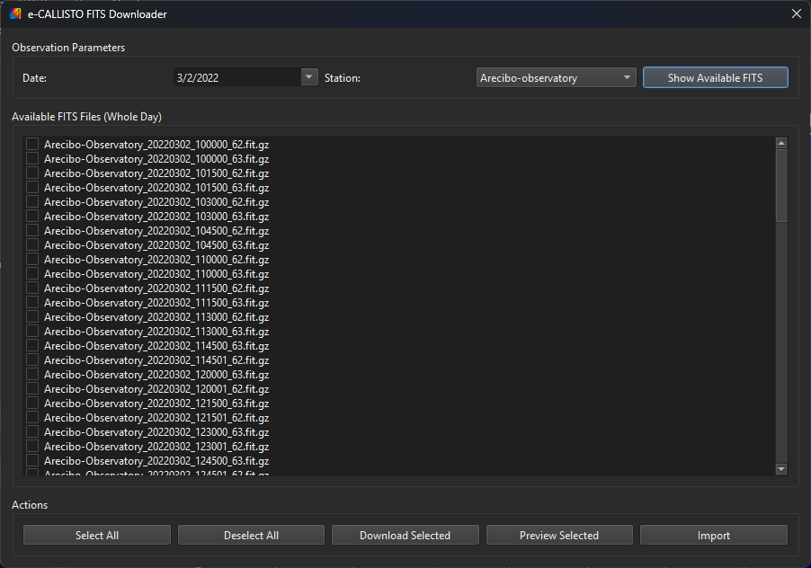
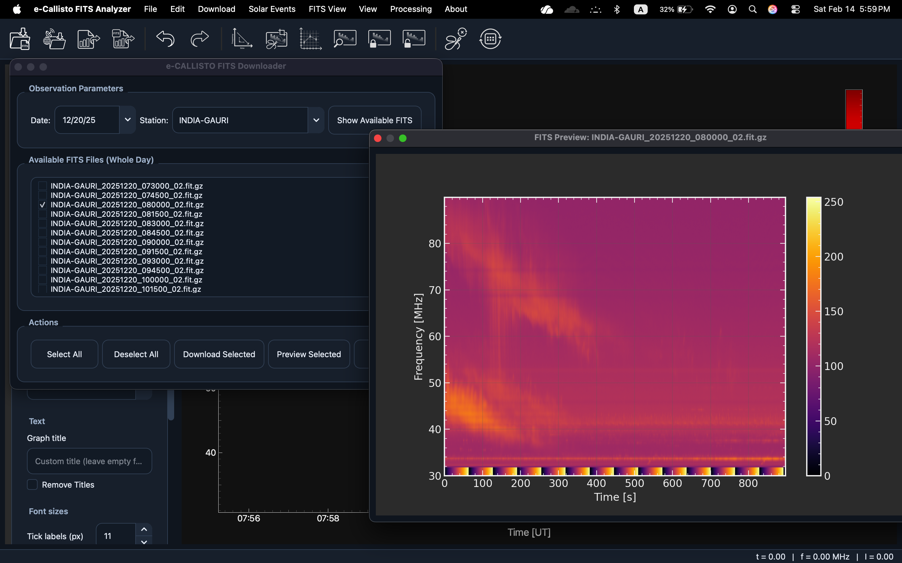
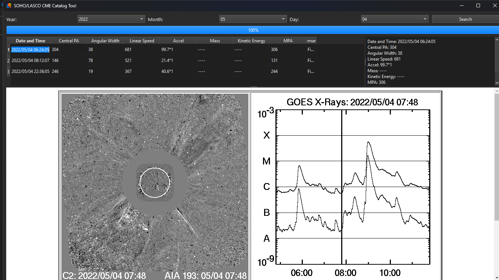
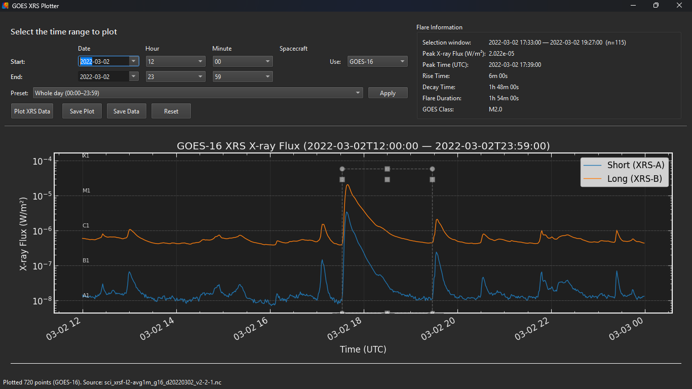

# e-CALLISTO FITS Analyzer (v2.3.0) 
A desktop application for visualizing, processing, and analyzing e-CALLISTO solar radio FITS data.

---

## ✨ Current Feature Highlights

### Dynamic spectrum workflow
- Load `.fit`, `.fits`, `.fit.gz`, and `.fits.gz` files, including combined time/frequency datasets.
- Use hardware-accelerated plotting with live cursor readouts, rectangular zoom, lock/unlock navigation, and **Edit → Reset to Raw** controls.
- Adjust intensity thresholds live with high-resolution sliders, value readouts, optional signed-log scaling, dB or Digits/ADU display modes, and graph-property controls.
- Inspect FITS headers, customize titles and labels, and export publication-ready figures from the current analysis view.

### Processing and analysis
- Apply deterministic RFI cleaning with preview/apply/reset controls for median smoothing, hot-channel masking, masked-channel repair, and percentile clipping.
- Isolate radio bursts, extract maximum intensities, remove outliers manually or automatically, and run best-fit / shock-parameter analysis.
- Keep polygon, line, and text annotations inside the accelerated view, with editable text styling and project persistence.
- Save and reuse processing presets, reopen restored analysis sessions, and run batch processing for folder-based FIT/FITS exports.

### Solar-event context tools
- Open standalone viewers for GOES X-ray flux, GOES SEP proton flux, SOHO/LASCO CME catalog data, Kyoto Dst, and GFZ Kp.
- Overlay GOES XRS curves directly on the main spectrum with automatic GOES-16 through GOES-19 fallback and flare-class guides.
- Explore external archives with the SunPy Multi-Mission Explorer for SDO, SOHO, STEREO-A, and GOES products.
- Sync the current analyzer time window across supported solar-event windows for faster cross-comparison.

### Reproducibility and support
- Save full analyzer state as `.efaproj` project files and recover recent autosave snapshots.
- Export processed FITS files, provenance reports (Markdown + JSON), and analysis logs (CSV + TXT).
- Generate diagnostics ZIP bundles for bug reports and open a prefilled GitHub issue draft from inside the app.
- Use the built-in citation dialog to copy the recommended citation or BibTeX entry, and check for newer GitHub releases from the app.

---

## 📘 User Guide

This guide explains how to use the main features of the **e-CALLISTO FITS Analyzer**, including dynamic spectrum visualization, live noise reduction, annotations, burst isolation, drift estimation, maximum intensity extraction, best-fit analysis, FITS export, the FITS downloader, and the built-in CME, GOES, SEP, Dst, Kp, and SunPy modules.

---

# 1. Main Interface

After launching the application, the main window opens with tools for loading FITS files, adjusting thresholds, selecting colormaps, isolating bursts, navigating the spectrum, and performing scientific analysis.

The main functions are available through a compact **icon toolbar** for quick access and a clean layout.

### **Main Window**

---

# 2. Loading a FITS File

You can load:

- **Compressed FITS:** `*.fit.gz`, `*.fits.gz`
- **Uncompressed FITS:** `*.fit`, `*.fits`

This supports observers who work directly with uncompressed raw data.

Choose **File → Open** or click the **Open** icon on the toolbar.  
The dynamic spectrum appears immediately.

---

# 3. Noise Reduction (Live Threshold Scrollbars)

Noise reduction updates **live** without pressing Apply.

Features:

- High-resolution lower and upper clipping sliders for smoother Vmin / Vmax adjustment
- Live threshold readouts next to each slider for quick feedback while dragging
- Optional **Logarithmic Threshold Scale** checkbox for finer control near zero
- Dynamic spectrum refreshes automatically
- No data are lost when switching x-axis units (seconds ↔ UT)

### Example: Noise Reduction

### RFI Cleaning Toolkit (Processing → RFI Cleaning)

RFI cleaning applies a deterministic pipeline to 2D dynamic spectrum data (**frequency × time**).  
Use **Preview** to inspect results first, then **Apply** to commit.

Processing steps:

1. 2D median smoothing with **Kernel (freq) × Kernel (time)**.
2. Hot-channel detection using a robust Z-score from each channel's level + variability.
3. Masked-channel repair by replacing flagged channels from neighboring channels.
4. Per-channel upper percentile clipping (high outliers only; low side preserved).

Parameter guide:

- **Kernel (time)**: median window along time. Higher values suppress short spikes more, but can blur fast burst structure.
- **Kernel (freq)**: median window across frequency channels. Higher values reduce narrow-band striping, but can widen spectral features.
- **Channel Z threshold**: robust outlier cutoff for hot-channel masking. Lower values mask more channels; higher values mask fewer.
- **Percentile clip**: upper cap per channel. Lower values clip peaks more aggressively; higher values preserve strong peaks.
- **Masked channels**: count/list of detected hot channel indices shown in the panel after Preview/Apply.

Suggested tuning workflow:

1. Start with defaults: `kernel(time)=3`, `kernel(freq)=3`, `Channel Z threshold=6.0`, `percentile clip=99.5`.
2. If channel streaks remain, lower **Channel Z threshold** gradually (for example `6.0 → 5.0 → 4.0`).
3. If burst detail looks over-smoothed, reduce kernel sizes and/or raise **Channel Z threshold**.
4. Use **Preview** repeatedly, then **Apply** when satisfied.
5. Use **Reset** in the RFI panel to restore default RFI settings. Use **Edit → Reset to Raw** to fully revert applied data.

### Example: RFI Cleaning

---

# 4. Intensity Scale and Units

The color-bar (z-axis) provides clearer physical meaning.

Features:

- Explicit intensity labeling on the color-bar
- Unit selector for:
  - **Digits / ADU**
  - **Optional dB scaling**
- Unit changes update the display immediately

This improves interpretability across different observing stations.

---

# 5. Colormap Selection

The **Colormap** panel allows choosing from several scientifically useful palettes:

- Custom (blue–red–yellow)
- Viridis
- Plasma
- Inferno
- Magma
- Cividis
- Turbo
- RdYlBu
- Jet
- Cubehelix
- bone_r

The plot updates as soon as a colormap is selected.

---

# 6. Graph Properties Panel

A **Graph Properties** panel is included to adjust plot appearance from one place.

Typical use cases:

- Update titles and labels for exports
- Adjust plot styling for clearer presentation
- Keep visual settings consistent across plots

---

# 7. Navigation: Zoom and Pan

Interactive navigation is available in the dynamic spectrum.

Features:

- **Scroll wheel:** Zoom in and out
- **Click + drag:** Pan across time and frequency
- Navigation works alongside noise reduction and colormap changes

This allows precise inspection of fine spectral structures.

---

# 8. Cursor Data Display

When moving the mouse cursor over the plot area, the status bar displays:

- Time
- Frequency
- Intensity value (in selected units)

This enables quick quantitative inspection without additional clicks.

---

# 9. Burst Isolation (Lasso Tool)

Click **Isolate Burst** and draw around the emission region.  
Only the selected region is retained for further analysis.

### Example: Isolated Burst

---

# 10. Maximum Intensities Extraction

Click **Plot Maximum Intensities** to compute the maximum frequency for each time channel after noise reduction or burst isolation.

### Example: Maximum Intensities

---

# 11. Outlier Removal

Inside the Maximum Intensities window:

- Draw a lasso to select outliers
- Remove them instantly
- Keep manual cleanup controls available even when automatic outlier removal is enabled
- Prepare the cleaned curve for fitting

---

# 12. Burst Analyzer (Best Fit & Shock Parameters)

The Analyzer window performs:

- Power-law fitting of the Type II backbone
- Drift-rate evaluation
- Shock speed
- Shock height
- R² and RMSE

Newkirk model option:

- **Newkirk fold number** can be selected as:
  - **1, 2, 3, 4**

Optional additional plots:

- Shock speed vs height
- Shock speed vs frequency
- Height vs frequency

### Example: Analyzer

Export options:

- Best-fit graph (PNG, PDF, EPS, SVG, TIFF)
- Data summary to Excel
- Multiple additional plots

---

# 13. FITS Downloader

Open via **Download → Launch FITS Downloader**.

Features:

- Select station, date, and hour
- Fetch available files from the server
- Preview selected files
- Download multiple FITS files
- Import selected FITS files directly into the Analyzer
- Automatic detection of frequency or time stitching compatibility
- Clear error messages when selected files cannot be combined

### Example: Downloader

---

# 14. Combine FITS Files

Two combination modes are supported.

### **Combine Frequency**
Merge consecutive frequency bands when time bases match.

### **Combine Time**
Merge consecutive time segments from the same station and date.

If files do not meet the required criteria, a message box alerts the user.

Combined data can be imported directly into the Analyzer.

---

# 15. Save and Reopen Analysis Projects

You can save the full analysis state to a project file and restore it later.

Path:

- **File → Save Project**
- **File → Save Project As...**
- **File → Open Project...**

Project format:

- **e-CALLISTO Project:** `*.efaproj`

Saved state includes plot view, thresholds, units, colormap, graph properties, loaded/combined data, and analysis-session state.

---

# 16. Export Data as FITS

You can now export processed data as a new FITS file with a modified header. This is useful for downstream analysis and **Machine Learning** workflows.

Export options:

- **Raw view**
- **Background-subtracted view**
- **Combined datasets** (time/frequency) with compatibility-preserving metadata updates

Path:

- **File → Export As → Export to FIT**

---

# 17. Saving and Exporting Plots

All figures across the application can be exported in:

- PNG
- PDF
- EPS
- SVG
- TIFF

Export handling improvements:

- Export errors for PDF, EPS, and SVG formats have been resolved
- On Windows, if the default save location is restricted (for example `C:\Program Files`), the user is prompted to select an alternate folder

This supports publication workflows across operating systems.

### Provenance and Analysis Logs

For reproducibility and audit trails, the app can export two structured report types from **File → Export As**:

- **Export Provenance Report...** writes both Markdown and JSON summaries of the loaded data source, processing settings, RFI configuration, annotations, time-sync state, and operation log.
- **Export Analysis Log...** writes CSV and plain-text summaries of analyzer fit parameters and derived shock metrics.

These reports are useful for lab notebooks, collaboration handoffs, and paper preparation.

---

# 18. CME Catalog Viewer (SOHO/LASCO)

Features:

- Retrieve daily CME lists
- Display CME parameters in a structured table
- Show associated LASCO movies
- Event metadata panel

### Example: CME Viewer

---

# 19. GOES X-Ray Flux Viewer and Overlay

Features:

- Open a standalone GOES X-ray viewer for time-window inspection and flare analysis
- Enable **Solar Events → GOES Overlay → Long(XRS-B)** and/or **Short(XRS-A)** to draw GOES curves on the current FITS spectrum
- Automatically fall back across **GOES-16** to **GOES-19** when loading overlay archives
- Display GOES overlay curves with a dedicated right-side flare-class guide (**A / B / C / M / X**) without modifying the spectrogram data
- Adjust time windows, extract flare parameters, and export plots/data from the standalone GOES viewer

### Example: GOES X-Ray Viewer

---

# 20. GOES SEP Proton Flux Viewer

Path:

- **Solar Events → Energetic Particles → GOES SEP Proton Flux**

Features:

- Plot GOES SEP proton flux from the NOAA SGPS archive across multi-day UTC ranges
- Automatically try **GOES-19** through **GOES-16**, with manual spacecraft override available in the window
- Show proton channels closest to about **10 MeV** and **100 MeV**, along with hover readouts and selection-based event metrics
- Export both the plotted figure and the stitched flux table as PNG/CSV

### Geomagnetic Indices (Dst and Kp)

Path:

- **Solar Events → Geomagnetic → Kyoto Dst Index**
- **Solar Events → Geomagnetic → GFZ Kp Index**

Features:

- Fetch geomagnetic activity data across custom UTC ranges directly inside the desktop app.
- Visualize Kyoto Dst and GFZ Kp with dedicated storm-level guides for quick contextual interpretation.
- Export both plots and tabular data as PNG/CSV for reporting and comparison with solar-radio observations.

---

# 21. SunPy Multi-Mission Explorer

Path:

- **Solar Events → Archives → SunPy Multi-Mission Explorer**

Supported v1 instruments:

- **SDO/AIA** (map products)
- **SOHO/LASCO C2/C3** (map products)
- **STEREO-A/EUVI** (map products)
- **GOES/XRS** (time-series products)

Features:

- Search SunPy archives using spacecraft/instrument/time filters
- Download selected records into an app-managed cache
- Plot map products with frame stepping and running-difference mode
- Compute ROI image statistics (min/max/mean/median/std/P95/P99)
- Plot GOES/XRS channels and derive basic flare summary metrics
- Export plots and analysis summaries

Known limitations:

- Requires network access for archive search/download (cached files can be reopened offline)
- JSOC/HMI workflows are not part of v1

---

# 22. Support and Research Tools

### Report a Bug

Use **About → Report a Bug...** to open the in-app diagnostics workflow.

- Capture session details, environment information, and user notes in a single report dialog.
- Generate a diagnostics ZIP bundle that can include structured provenance summaries for easier troubleshooting.
- Open a prefilled GitHub issue draft or copy the issue text before submitting.

### Cite this Software

Use the **Cite this Software** button in the main window to open the citation dialog.

- Copy the recommended citation text for the e-CALLISTO FITS Analyzer paper.
- Copy the BibTeX entry directly into your manuscript or reference manager workflow.

### Check for Updates

Use **About → Check for Updates...** to query the latest release from GitHub.

- If a newer version is available, the app shows current/latest versions and a direct download action.
- Downloads run in-app and save the installer/package to your selected location.
- If you are up to date, the app confirms your current version.
- If the check fails (for example, no network), the app shows a clear error message.

---

## 🛠️ Build and Packaging

### Prerequisites
- Python 3.12+ is recommended for local development and Windows/macOS packaging.
- Linux packaging scripts can also work with Python 3.11+ when required by the target system.

### Run from Source
- Create and activate a virtual environment.
- Install dependencies:
  - `python src/Installation/install_requirements.py`
- Start the app:
  - `python src/UI/main.py`
- Start the standalone Kyoto Dst index plotter:
  - `python src/UI/dst_index_gui.py`
- Start the standalone GFZ Kp index plotter:
  - `python src/UI/kp_index_gui.py`
- Start the standalone GOES SEP proton flux plotter:
  - `python src/UI/goes_sgps_gui.py`

### Build dependencies
- Install runtime dependencies:
  - `python src/Installation/install_requirements.py`
- Install build tooling:
  - `python -m pip install pyinstaller pyinstaller-hooks-contrib`
  - macOS only: `python -m pip install py2app`

### Windows (PyInstaller + optional Inno Setup installer)
- Recommended scripted build:
  - `powershell -ExecutionPolicy Bypass -File .\src\Installation\build_windows_installer.ps1`
- Optional app-folder-only build:
  - `powershell -ExecutionPolicy Bypass -File .\src\Installation\build_windows_installer.ps1 -SkipInstaller`
- Manual installer script:
  - `src/Installation/FITS_Analyzer_InnoSetup.iss`

### Linux (.deb + PyInstaller)
- Debian/Ubuntu build prerequisites:
  - `sudo apt-get update`
  - `sudo apt-get install -y python3-venv python3-pip`
- Use Python `3.11+` for packaging. If you already have a working project venv, the script will prefer it automatically.
- If your machine uses a stale pip mirror, point the build at official PyPI:
  - `PIP_INDEX_URL=https://pypi.org/simple bash src/Installation/build_deb_linux.sh`
- If you need a specific interpreter:
  - `PYTHON_BIN=/usr/bin/python3.13 bash src/Installation/build_deb_linux.sh`
  - `PYTHON_BIN="$(pwd)/.venv/bin/python" PIP_INDEX_URL=https://pypi.org/simple bash src/Installation/build_deb_linux.sh`
- Recommended `.deb` packaging workflow:
  - `bash src/Installation/build_deb_linux.sh`
- Manual PyInstaller build:
  - `pyinstaller src/Installation/FITS_Analyzer_linux.spec`

### macOS (py2app)
- Build app bundle:
  - `python src/Installation/setup.py py2app`

### Generic cross-platform spec
- Alternative build entry:
  - `pyinstaller src/Installation/FITS_Analyzer.spec`

---

## 📄 Notes

- Supports `.fit`, `.fits`, `.fit.gz`, and `.fits.gz`
- Project save/load format: `.efaproj`
- Live noise reduction with preserved zoom, pan, and axis format
- Cursor-based data readout for time, frequency, and intensity
- Provenance/report export and diagnostics bundles are available from the desktop UI
- Improved plotting area for clearer scientific visualization
- Robust export system with OS-aware save handling
- Major plots are publication ready
- Linux fallback for problematic GPU stacks: `CALLISTO_FORCE_SOFTWARE_OPENGL=1`

---

## ⭐ Credits

Developed by **Sahan S. Liyanage**  
Astronomical and Space Science Unit  
University of Colombo, Sri Lanka
