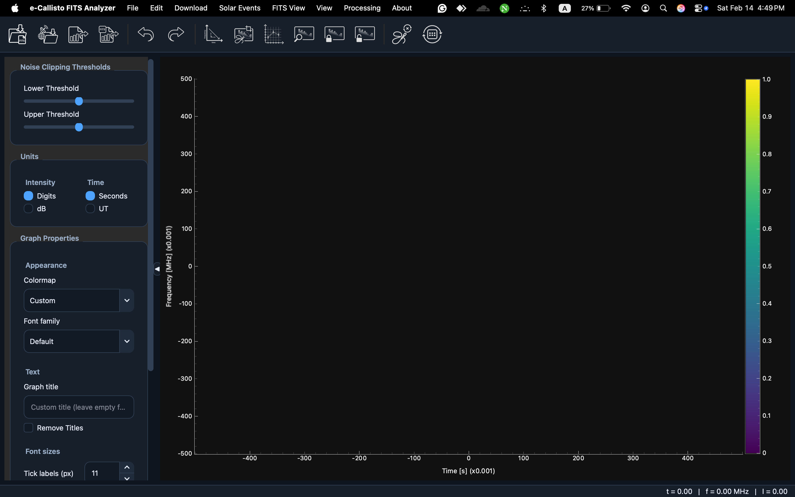
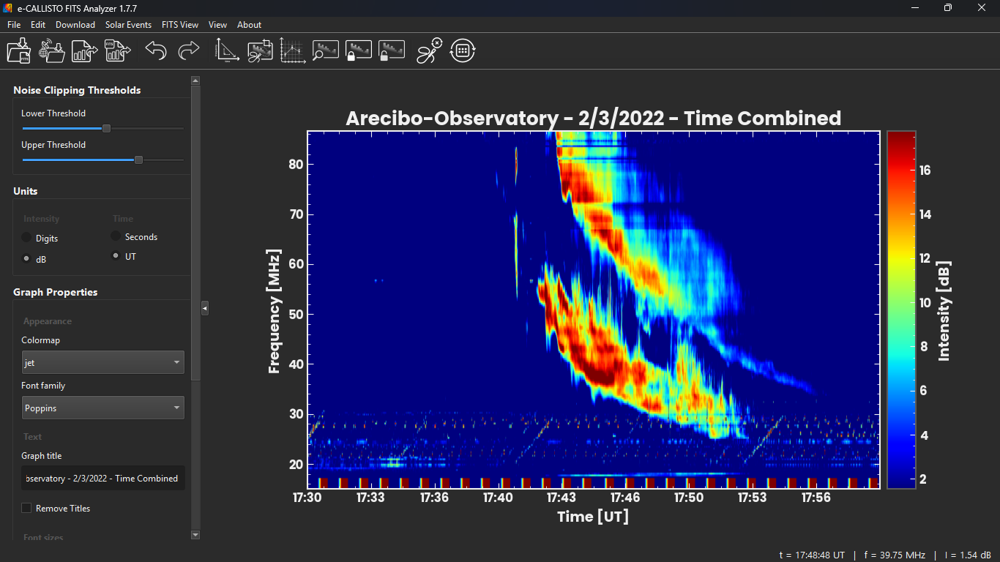
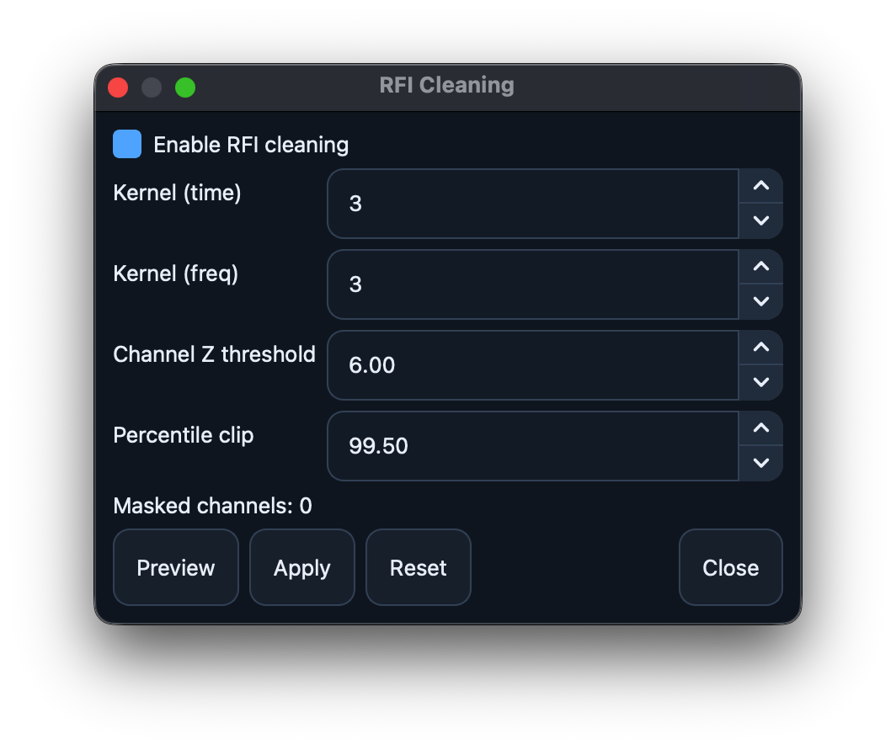
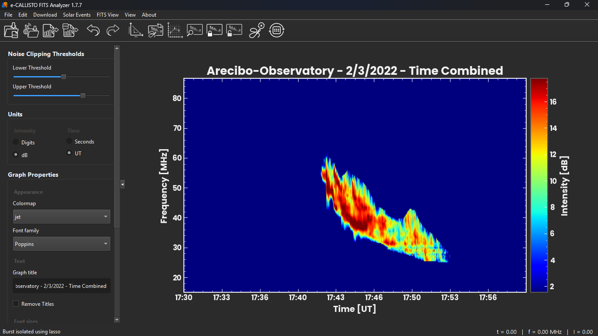
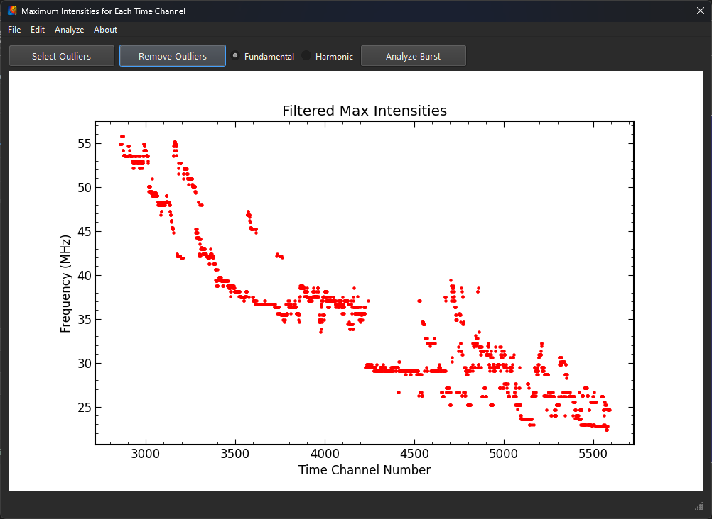
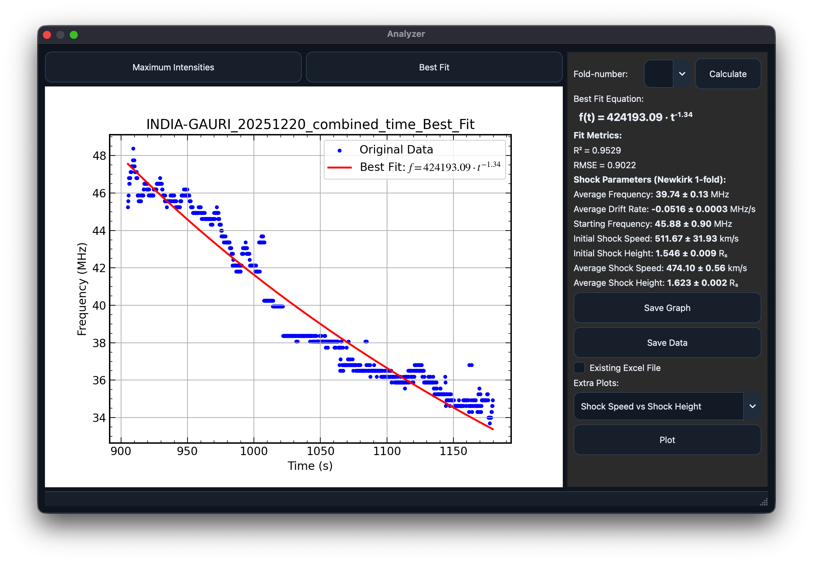
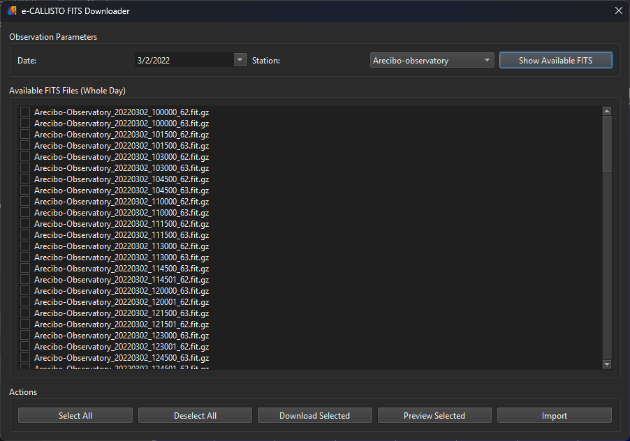
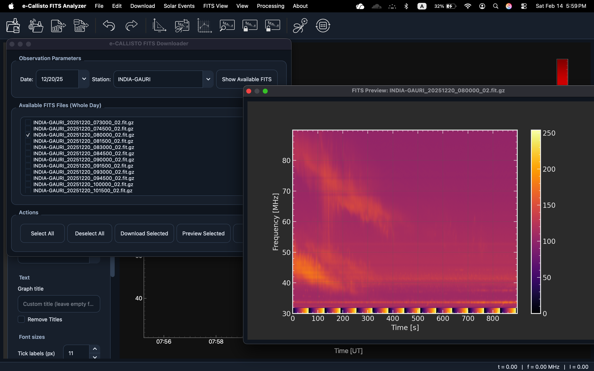
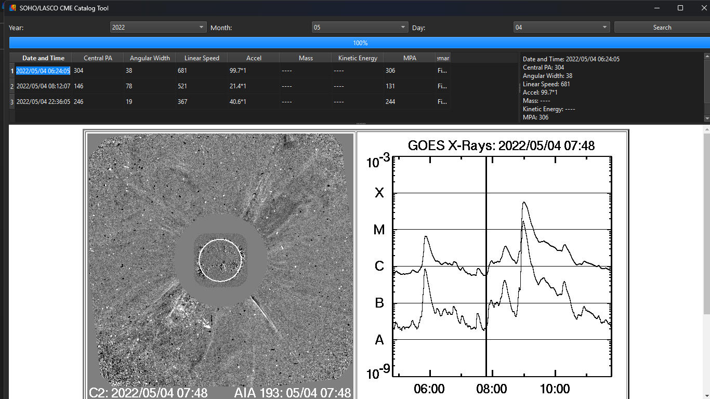
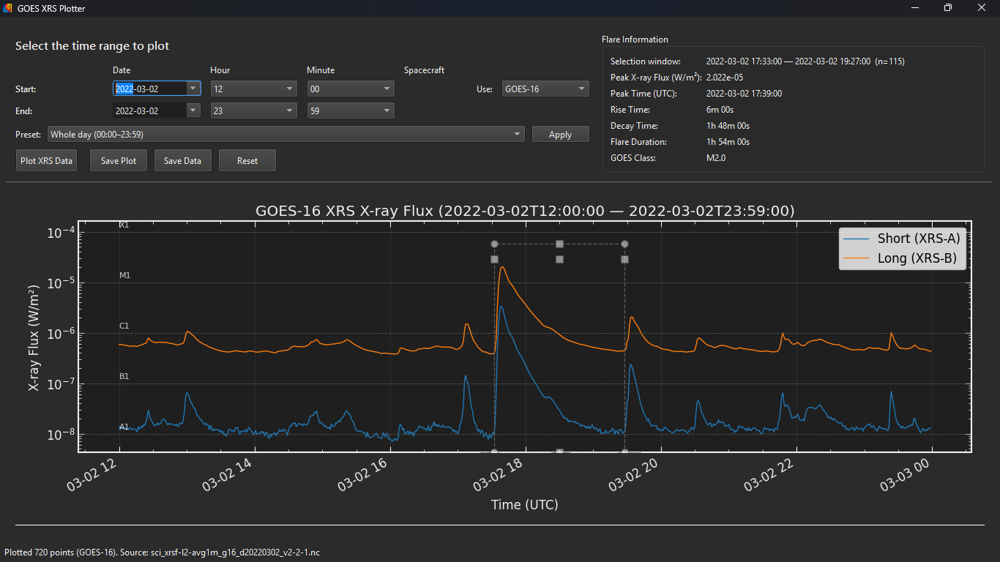

# e-CALLISTO FITS Analyzer (v3.1.0)
A desktop application for visualizing, processing, and analyzing e-CALLISTO solar radio FITS data and other solar physics related data.

## What's New in v3.1.0

This beta previews the upcoming **v3.1.0** release. The features below are already implemented in the beta.

### GCS fitting

- **Multi-view GCS CME and shock fitting:** reconstruct the CME flux rope from synchronized SOHO/LASCO and STEREO images, and fit its outer shock separately with a spheroid or ellipsoid. Each model keeps its own front points, recorded fits, height–time series and CSV export. The fitting window includes playback, focus layouts, image-difference modes and recorded-shell overlays.
- **Staged fit refinement:** **Refine fit** (`Ctrl+R`) now starts with just two front points, refining the height first. More points and suitable viewpoint separation allow direction and shape parameters to be fitted. For GCS, four points in two separated views add longitude and latitude; tilt, half-angle and thickness follow, reaching all six parameters at seven points. The status bar names the fitted parameters and shows how many more points are needed for the next stage. Shock refinement follows its own sequence of height, direction and shape parameters.
- **Viewpoint snapshots and height–time graphs:** export PNG, PDF, EPS, SVG, TIFF or JPG figures with a white background. Viewpoint exports include the displayed images, model wireframes, front points and observation captions; height–time graphs include the selected fit and kinematic results. Images are rendered from the data, fixing blank exports from hardware-accelerated panels.
- **GCS movies:** export the event sequence as GIF or MP4 with the recorded shells shown during playback. Movie exports restore the current time, working models, refinement results and front points afterward.
- **Detailed fitting reports:** export a PDF containing the current viewpoints, viewing geometry, recorded fits with their source images and parameters, and linear, quadratic and cubic height–time fits where supported by the available measurements. Reports include kinematic comparisons, uncertainties, method limits and references, and restore the working state after export.

### Background subtraction

- **Separate background-subtraction controls:** choose **Mean**, **Median** or **Median (dB)** independently of the live display thresholds.
- **Repeatable processing:** reapplying subtraction starts from the raw data, so changing methods replaces the previous result without stacking corrections.
- **Live display thresholds:** adjust the color-scale limits independently after subtraction; threshold changes do not clip the data.

## Additional features included in this beta

The beta also includes these archive, instrument, visualization and solar-image analysis capabilities:

### Working a burst across the archive, without leaving the plot
- **Timeline panel:** a loaded dataset now knows which station, focus codes and observation times it came from, and the sidebar's **Timeline** section lists them. **◀ Previous** / **Next ▶** fetch the adjacent 15-minute observation and time-combine it into the spectrum in place, one to eight steps at a time. Following a type II from its onset no longer means going back to the downloader and re-importing every file.
- **Kept work, kept processing:** annotations, the ruler measurement and drift picks survive an extension, and their time coordinates shift with the axis when an earlier observation is prepended, so they stay on the feature they were placed on. The background subtraction and RFI cleaning that were active are re-derived over the longer array rather than dropping the view back to Raw, and the threshold display limits carry over unchanged.
- **Trim and undo:** **Trim Start** / **Trim End** walk the dataset back, falling through to a plain single-file load at one segment, and both extension and trimming are a single **Ctrl+Z** away — arrays, source list and annotations together.
- **Local first, then the archive:** the adjacent observation is looked for among the loaded file's siblings on disk before any request is made, so a set already downloaded extends with no network at all. Day listings are cached per session, and adjacent files can be prefetched in the background.
- **Available-or-not, up front:** the panel says why a direction is unavailable — end of the archive day, or a timestamp that supplies only part of the focus set — instead of failing on the click.

### Linear and logarithmic frequency axis
- **New Axis section** in the sidebar switches the dynamic spectrum between **Linear** and **Log**. A logarithmic frequency axis spreads the decametric end of the band, where type II and type III bursts spend most of their drift, and makes a harmonic pair sit at a constant separation.
- Both renderers are supported. The matplotlib canvas warps the image under `set_yscale("log")`, so every coordinate stays in MHz; the hardware canvas re-samples the rows onto a uniform log grid, because its image is placed with a plain rectangle and cannot warp — but its public interface stays in MHz, so annotations, the ruler, light-curve picks and drift points behave identically in both scales.
- Ticks are anchored to the decades and labelled in MHz — 20, 30, 40, 50, 60, 70, 80 across a 20–80 MHz band; 50, 70, 100, 200, 300, 500, 700 across 45–870 — thinning as the span widens and falling back to round numbers over a band too narrow to hold one decade subdivision.
- The STEREO/SWAVES panel keeps its own native logarithmic axis in both modes, and the choice is remembered between sessions.

### Downloader organised around what is actually there
- **Grouped by focus code:** a day's files are listed per focus code rather than as one flat list, so which receivers covered an event is visible at a glance.
- **Previews that combine:** selecting several files previews them the way they would import — greedily combined where the set is combinable in time, in frequency, or both, and as separate panels where it is not.
- **A real cache:** previewed and downloaded files are kept in a persistent on-disk cache, so re-previewing, importing or extending never fetches the same file twice.

### Unified merging, and direct import from the multi-station view
- **Time × frequency in one step:** a complete grid of timestamps and focus codes now merges in a single operation — each timestamp frequency-combined, then the results stitched in time — with the gap-fill and overlap policy carried through, instead of requiring two passes.
- **Direct import from the multi-station event search:** a compatible selection found across stations can be imported straight into the main window, combining time-only, frequency-only or time + frequency automatically. The comparison workspace now opens only through the explicit **Compare** action, instead of appearing whenever a download finished.

### Solar Image Analysis (v1.6 beta)
- **PFSS coronal magnetic field modelling:** extrapolate the coronal field from a photospheric magnetogram and draw it straight onto the AIA disk, so modelled loop topology and coronal-hole boundaries can be compared against what the image actually shows. The **Potential Field (PFSS)** sidebar card solves the current-free field between the photosphere and a source surface (2.5 R☉ by default, adjustable), then traces field lines and classifies them: **open** lines reaching the source surface are coloured by the sign of the radial field at their footpoint — red outward, blue inward — while **closed** loops are drawn quieter beneath them, and the open-field regions can be outlined as the model's coronal holes.
  Four boundary conditions are supported. *GONG synoptic* is ground-based, updated daily and needs no registration — the usual choice. *HMI synoptic* is SDO's own, so it matches AIA instrumentally; searching JSOC is free, but downloading stages an export there and needs a registered e-mail, and the series is published about one Carrington rotation behind. *GONG ADAPT* runs a flux-transport model that estimates the unobserved far side instead of leaving it weeks stale, usually improving open-field predictions; one file holds 12 realizations. A *local FITS file* can also be supplied, and plate-carrée maps are reprojected to equal-area automatically. Downloads are cached, so changing a model parameter and re-solving does not fetch again.
  Seeds can be placed on a uniform grid, restricted to the current crop, clicked directly on the disk, or confined to open-field regions — a two-pass trace that shows coronal-hole connectivity without closed loops dominating the picture. Stepping through a sequence re-projects the same solution onto each frame rather than re-solving, which is correct: a synoptic magnetogram is valid across the rotation while the observer's view changes frame to frame. **Near side only** is on by default, because a field line rooted on the far side is not hidden once it rises above the limb and would otherwise be drawn as an arc outside the disk with no visible footpoint.
  **Diagnostics…** opens a four-panel audit: the input magnetogram with its provenance, the radial field at the source surface with its neutral line — where the heliospheric current sheet leaves the model, and its most directly checkable prediction — the open/closed footpoint map in Carrington projection, and the solution statistics including open flux and open-area fraction. A solve takes a few seconds and runs in the background.
  Because AIA carries no magnetic field information, the boundary condition is always a *synoptic* map assembled over a full solar rotation: the model therefore describes the global field *around* an observation rather than the instantaneous field, and the card shows how far the map's date sits from the displayed frame. PFSS needs the optional `sunkit-magex` package; without it the card stays visible but disabled and shows the install command.

- **Calibration level selection:** SDO/AIA series can be requested at level 1 or level 1.5, and GOES/SUVI at level 1b or level 2, with locally-prepared levels distinguished from archive-served ones.
- **Differential-rotation compensation:** a selected region can be pinned to the rotating solar surface across a multi-hour sequence in either of two modes — *track*, which moves the cut-out window and leaves the pixel values untouched for photometry and light curves, or *reproject*, which resamples every frame onto the reference-time grid so foreshortening is corrected and differencing is meaningful.
- **GCS CME Fitting — multi-view CME reconstruction:** open **Analysis → GCS CME Fitting…** from the main analyzer or Solar Image Analysis window. The selected UTC event/frame follows into new and reopened fitting windows. Three independently loaded Helioviewer JPEG2000 channels share one Graduated Cylindrical Shell, using the published geometry also implemented by [PyThea](https://www.pythea.org/en/docs/geometrical_models.html). The panels default, left to right, to STEREO-B COR2, LASCO C2 and STEREO-A COR2 for every event; after STEREO-B was lost in 2014 the left panel keeps STEREO-B COR2 and reports that it has no data, and any channel can still be switched by hand. Set the event range, adjust individual channel ranges if needed, and **Load all**. Every panel opens in running difference: the first image of each channel is differenced against the archive frame just before its range, and is shown explicitly as raw only when no earlier frame exists. A shared timestamp selects each channel's nearest image; captions show actual UTC times, offsets and difference-reference times. The shell is drawn in every view; **Max time offset** excludes images too far from the shared time from the fit (default 5 minutes; choose an appropriate limit for the CME's evolution). Changing a source or range invalidates old images and pending results. Clicked points follow their actual image and return when revisited.
  The **File, Event, View, Fit and Help** menus provide UTC navigation, playback, image modes, equal/focus layouts, zoom reset, overlay toggles, refinement, recording and exports. Six sliders with numeric entry control the shared model. Height is the leading edge's distance from Sun centre; intrinsic face-on and edge-on widths include the shell thickness. Trace the same ejecta front in independent views (GCS is a flux-rope model, not a shock model), align the shell manually, then use **Refine fit** for a local geometric adjustment. Empty, nearly coincident and nearly opposite viewpoints do not independently constrain direction. Formal errors are withheld when the local solution is unreliable, and become invalid after the model or observations change. [Reconstruction uncertainty](https://arxiv.org/abs/2302.00531) also includes front identification, timing and model assumptions; small residuals do not establish accuracy.
  **Commit GCS** records the fit and actual observation provenance. Repeated image combinations cannot masquerade as independent height–time samples. Double-click a recorded row to revisit its model; moving to a different event archives earlier fits in memory. Stepping forward or back, dragging the time slider and playback all draw the recorded shells: each fit on its own images, interpolated in time between recorded times (a display, not a fit) and held beyond the first and last; a model with nothing recorded keeps its sliders, so commit before stepping away. **Undo point** (Ctrl+Z) removes the front point clicked last in any panel, and the **Banner** toggle (B) hides the information banner across the top of each image. Kinematics are model-dependent radial estimates. Export **CSV** for the active numerical series, **JSON** for current/recorded/archived parameters, points and observation provenance, viewpoint snapshots and height–time graphs in **PNG/PDF/EPS/SVG/TIFF/JPG**, **GIF/MP4** movies, or a **PDF fitting report**. JSON is an analyzer analysis export, not a PyThea session file. **Help → Fitting workflow** explains the process and its limits.
  **Shock fitting:** choose **Edit: Shock** to fit the shock the CME drives — its faint outer envelope — with a spheroid or ellipsoid, drawn in every view alongside the GCS shell in its own colour. Parameters follow PyThea's convention exactly: apex height, κ = b/(height − 1 R☉), signed eccentricity ε (positive stretches the shock radially, negative flattens it) and, for an ellipsoid, α = b/c and a tilt about the radial axis; the centre distance and semi-axes are shown and exported under PyThea's names. Click the shock front and **Refine fit** pulls the model's exactly computed projected outline through the points in every view. With fewer than three views ε and tilt are weakly constrained, and an ellipsoid's shape parameters trade off — prefer a spheroid. Front points, recorded fits, kinematics, CSV (`cme_shock_fit.csv`), stepping and playback are kept separately for the shock, and the JSON export (schema 2) adds a `shock` section without changing the GCS keys.

- **Circle Fit — CME tracking for on-disk eruptions:** a new measurement tool for events near disk centre, where the front expands as a growing circle instead of marching outward from the limb, and a single leading-edge click has no well-defined origin to measure from. Click three or more points along the front and the least-squares circle is fitted and redrawn live from the third click on; **Commit Circle** (`Ctrl+Return`) records the frame and steps to the next, so a whole sequence is measured with one arc per frame. Under the spherical-bubble assumption the fitted radius *is* the CME height, so the sequence yields a radius–time plot with speed and acceleration — with the leading-edge distance from disk centre kept alongside it for comparison against a conventional height–time track.
- **A circle fit that survives a short arc:** the fit is Taubin's rather than the usual algebraic one, which is biased toward small radii on exactly the partial arcs a dome front gives, and it works in helioprojective arcsec so the front stays a circle even where the plate scale differs between the two axes. The panel warns when the clicked arc is too shallow to constrain the radius. **Lock centre** freezes the centre once the dome has settled and fits the radius alone. Circles, the clicked arcs and the lock state are all saved in `.ecsolar` sessions.
- **Higher-order kinematics with error bars:** a **Fit** dropdown under the tracking table fits the height–time or radius–time track as a line, a parabola or a cubic, and re-fits the points already on the plot when it changes. Linear reports one speed, with the acceleration taken from a companion quadratic fit as the CDAW CME catalogue does; the curved fits report the speed at *both ends* of the track, because an accelerating eruption has no single speed, and cubic adds the jerk. Every value carries a 1σ uncertainty propagated from the fit covariance, so the correlations between polynomial terms sit in the error bar instead of being assumed away — and the error is reported as unavailable, rather than as zero, when the fit has no degree of freedom left to estimate the scatter from. The chosen order travels with the session, since reopening a cubic analysis as a straight line would quietly change every speed it reports.

### Interface
- **Collapsible sidebar sections** in both the main window and Solar Image Analysis. Each section is a card with a clickable header; expanded and collapsed state is remembered between sessions, and section contents were pared back so controls are readable rather than stacked.
- The **Solar Image Analysis** menu entry is now just that, instead of carrying its instrument list, and **Type II Band-splitting** is no longer marked experimental.

### Performance
- The compute backend integration was reworked and the deprecated compute kernels removed. Accelerated paths remain opt-in where they were measured to help; on this class of hardware the algorithmic wins — single-sort row quantiles, lookup-table colour mapping, and segment reductions — carry the improvement.

---

## ✨ Current Feature Highlights

### Dynamic spectrum workflow
- Load `.fit`, `.fits`, `.fit.gz`, and `.fits.gz` files, including datasets combined across time, frequency, or both dimensions.
- Load ARTEMIS-IV (Thermopylae, Greece) `ARTLOOK` files directly: the hours-based UT time axis is converted on load, intensities are labelled and scaled as ADC counts with the ASG's own 58.51 counts/dB conversion, and the observation opens background subtracted because the receiver's channel gains span more than an order of magnitude.
- Extend a loaded dataset in place from the sidebar's **Timeline** section: fetch the previous or next observation from disk or the archive, time-combine it into the spectrum without leaving the plot, trim from either end, and undo any of it. Annotations, the ruler measurement and drift picks keep their place, and the active background subtraction and RFI cleaning are re-derived over the longer array.
- Switch the frequency axis between **Linear** and **Log** from the sidebar's **Axis** section, with decade-anchored ticks labelled in MHz and identical behaviour in the software and hardware-accelerated renderers.
- Download and analyze e-CALLISTO and Learmonth Station radio data, including Learmonth chunk conversion to FIT format for the main Analyzer.
- Use hardware-accelerated plotting with live cursor readouts, rectangular zoom, lock/unlock navigation, and **Edit → Reset to Raw** controls.
- Subtract the per-channel background from the sidebar's **Background Subtraction** section with **Mean**, **Median** or **Median (dB)**; it is always computed from the raw data, so re-applying replaces the result instead of stacking.
- Adjust the contrast live with high-resolution threshold sliders that set the color-scale limits only (the data are never clipped), value readouts, optional signed-log scaling, dB or Digits/ADU display modes, and graph-property controls.
- Apply the **Raw FITS Percentile (5-98%)** noise-clipping preset from **Processing → Presets** for a fast starting display range on raw FITS files.
- Inspect FITS headers from the **View** menu, customize titles and labels, and export publication-ready figures from the current analysis view.
- Generate project report PDFs that summarize the loaded dataset, processing state, analysis outputs, solar-context plots, and report-ready figures.

### Processing and analysis
- Apply deterministic RFI cleaning with preview/apply/reset controls for median smoothing, hot-channel masking, masked-channel repair, and percentile clipping.
- Isolate radio bursts with lasso masking aligned to the rendered spectrum path, extract maximum intensities, remove outliers manually or automatically, run best-fit / shock-parameter analysis, and perform Type II band-splitting analysis for magnetic-field estimates from noise-reduced data.
- Plot one or more light curves on top of the dynamic spectrum by entering a frequency or clicking directly on the plot, with configurable color, width, opacity, labels, and line style.
- Combine frequency bands with improved gap-filling and overlap-handling options before importing the merged spectrum.
- Keep polygon, line, and text annotations inside the accelerated view, with editable text styling and project persistence.
- Save and reuse processing presets, optionally choose a default preset for future FITS loads, reopen restored analysis sessions, and run batch processing for folder-based FIT/FITS exports.

### Solar-event context tools
- Open standalone viewers for GOES X-ray flux, GOES SEP proton flux, SOHO/LASCO CME catalog data, Kyoto Dst, and GFZ Kp.
- Overlay GOES XRS curves directly on the main spectrum with automatic legacy/modern GOES fallback and flare-class guides.
- Analyze SDO/AIA images from **Analysis -> Solar Data Analysis** with crop, difference, active-region, composite, and movie export tools.
- Measure a CME frame by frame in the Solar Image Analysis window with a ruler, intensity profiles, region statistics, leading-edge height–time tracking, and circle fitting for on-disk domes — reporting linear, quadratic or cubic kinematics with a 1σ error on every speed and acceleration.
- Reconstruct CME flux ropes and shocks in **Analysis → GCS CME Fitting…**, refine against clicked fronts, record each model over time, and export figures, movies and fitting reports.
- Extrapolate the coronal magnetic field with a PFSS model from GONG, HMI, ADAPT or a local synoptic magnetogram, and overlay open and closed field lines and coronal-hole boundaries on the AIA disk, with a four-panel diagnostics window for the source-surface field and solution statistics.
- Explore external archives with the SunPy Multi-Mission Explorer for SDO, SOHO, STEREO-A, and GOES products.
- Load STEREO/SWAVES space-based dynamic spectra (2.6 kHz - 16 MHz) below the CALLISTO spectrum on a shared time axis, and follow a burst out of the ground-based band into the interplanetary medium.
- Blend SDO, STEREO, and SOHO (EIT, LASCO) frames into one multi-instrument coronagraph composite that runs continuously from the disk out to the outer corona.
- Sync the current analyzer time window across supported solar-event windows for faster cross-comparison.

### Reproducibility and support
- Save full analyzer state as `.efaproj` project files and recover recent autosave snapshots.
- Export processed FITS files, provenance reports (Markdown + JSON), and analysis logs (CSV + TXT).
- Generate diagnostics ZIP bundles for bug reports and open a prefilled GitHub issue draft from inside the app.
- Use the built-in citation dialog to copy the recommended citation or BibTeX entry, and check for newer GitHub releases from the app.

---

## 📘 User Guide

This guide explains how to use the main features of the **e-CALLISTO FITS Analyzer**, including dynamic spectrum visualization, live noise reduction, annotations, burst isolation, drift estimation, maximum intensity extraction, best-fit analysis, Type II band-splitting analysis, FITS export, the e-CALLISTO and Learmonth radio downloaders, and the built-in CME, GOES, SEP, Dst, Kp, and SunPy modules.

---

# 1. Main Interface

After launching the application, the main window opens with tools for loading FITS files, adjusting thresholds, selecting colormaps, isolating bursts, navigating the spectrum, and performing scientific analysis.

The main functions are available through a compact **icon toolbar** for quick access and a clean layout.

### **Main Window**


---

# 2. Loading a FITS File

You can load:

- **Compressed FITS:** `*.fit.gz`, `*.fits.gz`
- **Uncompressed FITS:** `*.fit`, `*.fits`

This supports observers who work directly with uncompressed raw data.

Choose **File → Open** or click the **Open** icon on the toolbar.  
The dynamic spectrum appears immediately.

---

# 3. Noise Reduction (Background Subtraction and Live Threshold Scrollbars)

Noise reduction is two separate steps in the left sidebar:

1. **Background Subtraction** — pick **Mean**, **Median** or **Median (dB)** and click **Subtract Background**. The result is always computed from the raw data, so switching method and clicking again replaces it. Median (dB) converts to dB above the per-channel median (the Plotutil recipe, matching batch processing).
2. **Noise Clipping Thresholds** — the sliders set the color-scale limits (Vmin / Vmax) **live** without pressing Apply. They change the contrast only; the data are never clipped.

Features:

- High-resolution lower and upper threshold sliders for smoother Vmin / Vmax adjustment
- Live threshold readouts next to each slider for quick feedback while dragging
- Optional **Logarithmic Threshold Scale** checkbox for finer control near zero
- Per-channel mean, median, or median (dB) background subtraction for both single-band and frequency-combined plots
- **Processing → Presets → Raw FITS Percentile (5-98%)** sets the threshold limits from the distribution of the data currently shown
- Saved processing presets can be applied manually or selected as the default preset for future FITS loads
- Dynamic spectrum refreshes automatically
- No data are lost when switching x-axis units (seconds ↔ UT)

### Example: Noise Reduction


### RFI Cleaning Toolkit (Processing → RFI Cleaning)

RFI cleaning applies a deterministic pipeline to 2D dynamic spectrum data (**frequency × time**).  
Use **Preview** to inspect results first, then **Apply** to commit.

Processing steps:

1. 2D median smoothing with **Kernel (freq) × Kernel (time)**.
2. Hot-channel detection using a robust Z-score from each channel's level + variability.
3. Masked-channel repair by replacing flagged channels from neighboring channels.
4. Per-channel upper percentile clipping (high outliers only; low side preserved).

Parameter guide:

- **Kernel (time)**: median window along time. Higher values suppress short spikes more, but can blur fast burst structure.
- **Kernel (freq)**: median window across frequency channels. Higher values reduce narrow-band striping, but can widen spectral features.
- **Channel Z threshold**: robust outlier cutoff for hot-channel masking. Lower values mask more channels; higher values mask fewer.
- **Percentile clip**: upper cap per channel. Lower values clip peaks more aggressively; higher values preserve strong peaks.
- **Masked channels**: count/list of detected hot channel indices shown in the panel after Preview/Apply.

Suggested tuning workflow:

1. Start with defaults: `kernel(time)=3`, `kernel(freq)=3`, `Channel Z threshold=6.0`, `percentile clip=99.5`.
2. If channel streaks remain, lower **Channel Z threshold** gradually (for example `6.0 → 5.0 → 4.0`).
3. If burst detail looks over-smoothed, reduce kernel sizes and/or raise **Channel Z threshold**.
4. Use **Preview** repeatedly, then **Apply** when satisfied.
5. Use **Reset** in the RFI panel to restore default RFI settings. Use **Edit → Reset to Raw** to fully revert applied data.

### Example: RFI Cleaning


---

# 4. Intensity Scale and Units

The color-bar (z-axis) provides clearer physical meaning.

Features:

- Explicit intensity labeling on the color-bar
- Unit selector for:
  - **Digits / ADU**
  - **Optional dB scaling**
- Unit changes update the display immediately

This improves interpretability across different observing stations.

---

# 5. Colormap Selection

The **Colormap** panel allows choosing from several scientifically useful palettes:

- Custom (blue–red–yellow)
- Viridis
- Plasma
- Inferno
- Magma
- Cividis
- Turbo
- RdYlBu
- Jet
- Cubehelix
- bone_r

The plot updates as soon as a colormap is selected.

---

# 6. Graph Properties Panel

A **Graph Properties** panel is included to adjust plot appearance from one place.

Typical use cases:

- Update titles and labels for exports
- Adjust plot styling for clearer presentation
- Keep visual settings consistent across plots

---

# 7. Navigation: Zoom and Pan

Interactive navigation is available in the dynamic spectrum.

Features:

- **Scroll wheel:** Zoom in and out
- **Click + drag:** Pan across time and frequency
- **View → Set Display Range...:** enter exact start/stop times and frequency bounds for aligned station comparisons
- **View → Save/Apply Display Range Preset...:** reuse the same visible window on later files
- **View → Export/Import View Config...:** share display range, units, thresholds, colormap, and graph styling as `.efaview.json`
- **View → Multi-Station Comparison...:** compare several station spectra in vertically stacked panels with shared time/frequency axes, UT or seconds alignment, shared/per-station/manual color scaling, automatic time-only, frequency-only, and time + frequency combined views, Modern-mode hardware rendering, Classic-mode Matplotlib rendering, and visible-view export as PNG/PDF/EPS/SVG/TIFF
- Navigation works alongside noise reduction and colormap changes

This allows precise inspection of fine spectral structures.

---

# 8. Cursor Data Display

When moving the mouse cursor over the plot area, the status bar displays:

- Time
- Frequency
- Intensity value (in selected units)

This enables quick quantitative inspection without additional clicks.

---

### Light-Curve Overlays

Use **Analysis → Plot Light Curves** to overlay intensity-time curves on the dynamic spectrum.

Options:

- Enter a frequency manually
- Click directly on the spectrum to choose a frequency
- Use single-curve or multi-curve mode
- Customize curve color, thickness, opacity, vertical scale, line style, and frequency labels
- Clear all active light curves without resetting the loaded dataset

Light-curve overlays are preserved in project state and can be included in generated project reports.

---

# 9. Burst Isolation (Lasso Tool)

Click **Isolate Burst** and draw around the emission region.  
Only the selected region is retained for further analysis. In v2.6.0, the lasso mask is calculated against the rendered image pixel centers, so the isolated region follows the drawn path more accurately on the displayed spectrum.

### Example: Isolated Burst


---

# 10. Maximum Intensities Extraction

Use **Analysis → Maximum Intensities → Open Maximum Intensities** to compute the maximum frequency for each time channel after noise reduction or burst isolation.

### Example: Maximum Intensities


---

# 11. Outlier Removal

Inside the Maximum Intensities window:

- Draw a lasso to select outliers
- Remove them instantly
- Keep manual cleanup controls available even when automatic outlier removal is enabled
- Prepare the cleaned curve for fitting

---

# 12. Burst Analyzer (Best Fit & Shock Parameters)

The Analyzer window performs:

- Power-law fitting of the Type II backbone
- Drift-rate evaluation
- Shock speed
- Shock height
- R² and RMSE

Calculation updates in v2.6.0:

- Harmonic Type II shock calculations convert observed harmonic frequency/drift values to their fundamental equivalents before computing shock parameters
- Saved analysis summaries retain both the converted calculation values and observed-frequency reference fields
- Drift summaries are computed from valid, time-ordered segments and ignore zero-duration point pairs

Newkirk model option:

- **Newkirk fold number** can be selected as:
  - **1, 2, 3, 4**

Optional additional plots:

- Shock speed vs height
- Shock speed vs frequency
- Height vs frequency

### Example: Analyzer


Export options:

- Best-fit graph (PNG, PDF, EPS, SVG, TIFF)
- Data summary to Excel
- Multiple additional plots

---

# 13. Type II Band-Splitting Analyzer

Use **Analysis → Type II Band-splitting → Open Type II Band-splitting** to analyze split bands directly from the current noise-reduced dynamic spectrum.

Workflow:

- Add arbitrary points along the upper band
- Switch to the lower band and add points there
- Fit both bands with power-law curves
- Plot magnetic field versus shock height after successful calculation
- Calculate:
  - Shock speed
  - Shock height
  - Bandwidth
  - Compression ratio
  - Alfven Mach number
  - Alfven speed
  - Magnetic field

Important validation note:

- Derived magnetic-field values may not be accurate for all events or assumptions.
- Confirm results against already known or independently validated event data before using them for scientific conclusions.

---

# 14. Radio Data Downloaders

Open radio download tools via **Solar Events → Radio Bursts**.

### e-CALLISTO Downloader

Open via **Solar Events → Radio Bursts → e-CALLISTO**.

Features:

- Select station, date, and hour
- Fetch available files from the server
- Preview selected files
- Download multiple FITS files
- Import selected FITS files directly into the Analyzer
- Automatic detection of time-only, frequency-only, or complete time × focus-code grid compatibility
- Clear error messages when selected files cannot be combined
- Generate a station's full UTC-day spectral overview from the **Spectral Overview** tab
- Generate separate preview tabs for every focus code available for the selected station/date, or regenerate one selected code
- Apply a day-wide median_dB background baseline and export the organized six-panel overview
- Browse the [Monstein event catalog](https://soleil.i4ds.ch/solarradio/data/BurstLists/2010-yyyy_Monstein/) in **Burst List**, next to Spectral Overview
- Filter catalog events by UTC date range, burst type, reporting station, minimum station count, and text
- Select a burst, choose all reported stations or a specific archive station, adjust the time padding, and click **Find FITS**
- Preview, download, import, or compare the checked files using the shared FITS cache and import/combination workflow; the search includes overlapping 15-minute files and cross-midnight events
- Follow the visible progress bar for catalog loading, FITS searches, preview preparation, and downloads, including transfer progress and completed-file counts; completed progress remains visible
- Use **Reset Filters** to clear catalog filters while keeping the selected dates, and drag the divider to resize the event and FITS tables

Catalog coverage varies by year. Missing periods, source notices, and loading errors appear below the event list; hover over event rows for the original record and source URL. Station/type metadata may be unavailable in older lists, and catalog detections do not guarantee that matching FITS data is archived.

### Example: Downloader




### Learmonth Station Downloader

Open via **Solar Events → Radio Bursts → Learmonth**.

Features:

- Load or reuse cached Learmonth Station daily archive files for a selected date
- Inspect available Learmonth data chunks and their time ranges
- Download the raw Learmonth daily archive file when needed
- Convert selected Learmonth chunks into FIT files
- Import converted Learmonth FIT files directly into the Analyzer for the same noise reduction, visualization, and analysis workflow used by e-CALLISTO data

### STEREO/SWAVES Radio Spectrograph

Open via **Solar Events → Radio Bursts → SWAVES**.

SWAVES covers 2.6 kHz to 16 MHz from space, directly below the CALLISTO band, so a burst that drifts out of the
ground-based range can be followed into the interplanetary medium on the same figure.

Features:

- Choose a UTC start date and time plus a duration; data are NASA/SPDF level-2 one-minute averages served as one file per UTC day, and a window crossing midnight fetches and stitches both days automatically
- Select **STEREO-A (Ahead)** or **STEREO-B (Behind)**; Behind is disabled for dates after 2014-10-01, when contact with that spacecraft was lost
- The archive starts on 2006-10-27; downloaded day files are cached locally and reused
- **Use CALLISTO Window** copies the loaded spectrum's time range widened on both sides by the **Sync padding** value (30 minutes by default), so a slow-drifting type II or III burst is not cut off. **Solar Events → Sync Current Time Window** updates an open SWAVES dialog the same way
- Once loaded, the plotting area splits: CALLISTO above, SWAVES below, on a shared time axis, so panning or zooming either panel moves both. The CALLISTO interval is outlined on the SWAVES panel
- The SWAVES frequency axis is logarithmic and its intensity is decibels above the instrument background, so it keeps its own colorbar and color scaling while following the colormap chosen in the sidebar
- Loading SWAVES with no CALLISTO file open plots it across the full area; it folds into the split view as soon as a FITS file is loaded
- **Solar Events → SWAVES Panel** hides and restores the panel without discarding the loaded data
- The split view is included in **Save Plot** exports, saved in and restored from project files without re-downloading, and added to generated PDF reports

Notes:

- The drawing, lasso, drift, and measurement tools still act on the CALLISTO panel only
- Data-reduction controls do not yet apply to the SWAVES panel

---

# 15. Combine FITS Files

Open **File → Combine FITS Files...** for a unified workflow that detects time-only, frequency-only, and combined time + frequency selections. Compatible multi-file selections made through **File → Open** or imported from the downloader are detected automatically as well.

### **Combine Frequency**
Merge frequency bands with matching time bases. Frequency combining now has improved gap filling and overlap handling before the combined result is imported. When selected files contain a frequency gap or overlap, the app prompts for combine options. Gaps can be filled with interpolated background, average edge background, zeros, or a gray-hatched blank region. Overlapping bands can be split at a connection frequency, kept from the low band, kept from the high band, or rejected. The selected gap/overlap handling is retained in the combined dataset metadata where applicable.

### **Combine Time**
Merge consecutive time segments from the same station and focus code. Consecutive observations may continue across UTC midnight.

### **Combine Time + Frequency**
Merge a complete grid containing two or more consecutive timestamps and two or more focus codes. Every timestamp must contain the same focus-code set. The Analyzer first merges the frequency bands at each timestamp using one shared gap/overlap policy, verifies that every result has the same frequency grid, and then appends the results in time order. Incomplete grids, duplicate timestamp/focus pairs, non-consecutive timestamps, and incompatible axes are rejected with a detailed message.

If files do not meet the required criteria, a message box alerts the user.

The dialog previews the combined spectrum before importing it directly into the Analyzer. Combined exports and saved projects retain the original source list and the `time`, `frequency`, or `time_frequency` combine method.

---

# 16. Save and Reopen Analysis Projects

You can save the full analysis state to a project file and restore it later.

Path:

- **File → Save Project**
- **File → Save Project As...**
- **File → Open Project...**

Project format:

- **e-CALLISTO Project:** `*.efaproj`

Saved state includes plot view, thresholds, units, colormap, graph properties, loaded/combined data, and analysis-session state.

---

# 17. Export Data as FITS

You can now export processed data as a new FITS file with a modified header. This is useful for downstream analysis and **Machine Learning** workflows.

Export options:

- **Raw view**
- **Background-subtracted view**
- **Combined datasets** (time, frequency, or time + frequency) with compatibility-preserving metadata updates

Path:

- **File → Export As → Export to FIT**

---

# 18. Saving and Exporting Plots

All figures across the application can be exported in:

- PNG
- PDF
- EPS
- SVG
- TIFF

Export handling improvements:

- Export errors for PDF, EPS, and SVG formats have been resolved
- On Windows, if the default save location is restricted (for example `C:\Program Files`), the user is prompted to select an alternate folder

This supports publication workflows across operating systems.

Batch plot exports are available from **Processing → Batch Processing**. Background subtraction options include per-channel mean, per-channel median, and **median_dB**, which applies the `2500 / 255 / 25.4` digit-to-dB scale before median background removal and defaults to the median_dB `-1` to `8 dB` display range. Enable **Use current display range** or load a saved `.efaview.json` config to export multiple station spectra with identical time/frequency axes.

For visual station-to-station comparison, open **View → Multi-Station Comparison...**. Add multiple FITS files, choose UT-clock or seconds-from-file-start alignment, select shared/per-station/manual color scaling, set a shared display range, and export the visible comparison view as PNG, PDF, EPS, SVG, or TIFF. If the selected files are combinable across time, frequency, or a complete time × focus-code grid, the workspace renders combined views automatically; mixed-station selections are combined per station before comparison. The comparison workspace follows the app mode: Modern uses hardware-accelerated panels when available, while Classic uses Matplotlib.

### Provenance and Analysis Logs

For reproducibility and audit trails, the app can export two structured report types from **File → Export As**:

- **Export Provenance Report...** writes both Markdown and JSON summaries of the loaded data source, processing settings, RFI configuration, annotations, time-sync state, and operation log.
- **Export Analysis Log...** writes CSV and plain-text summaries of analyzer fit parameters and derived shock metrics.

These reports are useful for lab notebooks, collaboration handoffs, and paper preparation.

### Project Report PDF

Use **File → Generate Project Report...** to create a consolidated PDF for the current project or loaded dataset.

The report can include:

- Raw dynamic spectrum
- Background-subtracted dynamic spectrum
- Light curves with the dynamic spectrum
- Maximum-intensity fit
- Type II band-splitting output
- Available GOES X-ray, GOES SGPS proton flux, Dst, and Kp context plots

The obsolete **Burst Isolated Dynamic Spectrum** report section has been removed in v2.6.0.

---

# 19. CME Catalog Viewer (SOHO/LASCO)

Features:

- Retrieve daily CME lists
- Display CME parameters in a structured table
- Show associated LASCO movies
- Event metadata panel

### Example: CME Viewer


---

# 20. GOES X-Ray Flux Viewer and Overlay

Features:

- Open a standalone GOES X-ray viewer for time-window inspection and flare analysis
- Select from historical and modern GOES XRS spacecraft directly in the standalone viewer
- Enable **Solar Events → GOES Overlay → Long(XRS-B)** and/or **Short(XRS-A)** to draw GOES curves on the current FITS spectrum
- Automatically fall back across date-appropriate **legacy and modern GOES XRS satellites** when loading overlay archives
- Display GOES overlay curves with a dedicated right-side flare-class guide (**A / B / C / M / X**) without modifying the spectrogram data
- Adjust time windows, extract flare parameters, and export plots/data from the standalone GOES viewer

### Example: GOES X-Ray Viewer


---

# 21. GOES SEP Proton Flux Viewer

Path:

- **Solar Events → Energetic Particles → GOES SEP Proton Flux**

Features:

- Plot GOES SEP proton flux from the NOAA SGPS archive across multi-day UTC ranges
- Automatically try **GOES-19** through **GOES-16**, with manual spacecraft override available in the window
- Show proton channels closest to about **10 MeV** and **100 MeV**, along with hover readouts and selection-based event metrics
- Export both the plotted figure and the stitched flux table as PNG/CSV

### Geomagnetic Indices (Dst and Kp)

Path:

- **Solar Events → Geomagnetic → Kyoto Dst Index**
- **Solar Events → Geomagnetic → GFZ Kp Index**

Features:

- Fetch geomagnetic activity data across custom UTC ranges directly inside the desktop app.
- Visualize Kyoto Dst and GFZ Kp with dedicated storm-level guides for quick contextual interpretation.
- Export both plots and tabular data as PNG/CSV for reporting and comparison with solar-radio observations.

---

# 22. Solar Data Analysis

Path:

- **Analysis -> Solar Data Analysis**

Features:

- Search and download image records using the existing SunPy cache workflow, for SDO/AIA, SDO/HMI, SOHO/EIT (171/195/284/304 A), SOHO/LASCO C2/C3, STEREO-A/B SECCHI (EUVI, COR1, COR2, HI1, HI2) and GOES/SUVI
- Load local `.fit`, `.fits`, `.fit.gz`, and `.fits.gz` files
- Plot image sequences with frame stepping, playback, running-difference, and base-difference modes
- Crop image sequences using the plot-window ROI selector
- Detect bright active-region candidates and export centroid/bounding-box/intensity summaries as CSV
- Optionally fetch NOAA/HEK active-region labels and overlay them on detected regions
- Create simple RGB composites from loaded AIA frames
- Export the current plot, cropped FITS products, animated GIFs, and MP4 movies

**A note on SOHO/EIT products.** The archive serves two files for every EIT
observation — the calibrated Level 1 FITS and the raw level-zero file — and the
server ignores a processing-level filter, so the window picks one per observation
itself: Level 1 wherever it exists, and the raw file otherwise. Level 1
processing runs about a year behind the raw archive, so recent EIT searches
return raw frames while older ones return calibrated ones. Either way you get one
frame per observation, which is what difference imaging and playback need. EIT is
still observing, at a much lower cadence than in SOHO's early years; as with
LASCO, a date ahead of the archive frontier falls back to the nearest available
data and says so. **Live Preview** opens Helioviewer quicklook imagery for both
SOHO instruments, which is the only way to see the last few months of EIT.

### Measurement Tools

Tick **Measurements** in the toolbar above the image to enable the tools; the CME tracking panel on the right
becomes available with them. One tool is active at a time, and right-click or `Esc` cancels a pick in progress
without leaving the tool.

| Tool | What it does |
|---|---|
| **Ruler** | Two clicks give the plane-of-sky distance in arcsec, Mm and R☉, plus the position angle (N→E). |
| **Profile** | Two clicks plot the intensity along the cut — across a loop, a filament or a CME front. |
| **Region Stats** | Summarises the crop rectangle: pixel count, mean/median/min/max/σ and the intensity-weighted centroid. Enable **Rectangle crop** first to choose the region. |
| **Track CME** | One click per frame on the leading edge. The height is its distance from disk centre; the frame auto-advances and each pick lands in the table. Best for limb events. |
| **Circle Fit** | Three or more clicks along a circular front per frame. The fitted radius is the height. Best for eruptions near disk centre. |
| **GCS CME Fitting** | A separate three-viewpoint window (Analysis menu). Match one 3-D Graduated Cylindrical Shell to the flux-rope front, and optionally a spheroid or ellipsoid to the shock, in every view at once. Apex heights are **de-projected under the model assumptions**; derived radial speeds depend on viewing geometry, timing and front selection. |
| **Clear** | Resets every measurement: picks, circles, table and overlays. |

**Circle Fit workflow.** Pick the tool, click along the visible front — the fitted circle appears from the third
click and tightens with each extra point — then press **Commit Circle** (`Ctrl+Return`). The frame advances and
the row appears in the table with the radius in R☉, the leading-edge distance, the position angle of the centre,
and the number of points; the fit residual and centre are in the row's tooltip. Repeat across the sequence and
press **Fit** for the kinematics.

- Click a **wide** arc. A short one is fitted happily but constrains the radius very weakly, and the panel says so
  below about 30°.
- **Lock centre** freezes the centre at its current fitted value so later frames fit the radius alone. Useful once
  the dome has stopped drifting; leave it off while the centre is still moving.
- Re-committing a frame replaces its entry, so a bad fit is corrected by clicking it again.

**Fit order.** The dropdown under the table chooses the polynomial:

- **Linear** — one speed for the whole track. The acceleration comes from a companion quadratic fit, the pairing
  the CDAW CME catalogue reports.
- **Quadratic** — constant acceleration, with the speed given at the first and last frame.
- **Cubic** — constant jerk, with the acceleration given at both ends as well.

Every value carries a 1σ error from the fit covariance. A degree-*n* fit needs *n*+1 points to exist and *n*+2
before an error bar can be estimated at all; below that the value is shown without one rather than with a
misleading zero. **Export CSV** saves the table, and the whole analysis — picks, circles, fit order — is stored
in and restored from `.ecsolar` session files.

### Overlay Layers (multi-instrument coronagraph composites)

A CME is never visible in one instrument: the eruption starts on the disk (AIA, EIT, EUVI), crosses the low corona
(LASCO C2, COR1), and expands into the outer corona (LASCO C3, COR2), each imager blind to the others' domain
because of its occulter. The **Overlay Layers** panel appears in the sidebar for coronagraph views and blends
them into one image.

Features:

- Add SDO/AIA, SDO/HMI, SOHO/EIT, SOHO/LASCO C2/C3, STEREO SECCHI (EUVI, COR1, COR2, HI), or GOES/SUVI as a layer over the loaded coronagraph series
- Each layer's frames are searched and downloaded automatically, then time-matched to every loaded frame within the **Time match** window (30 minutes by default; widen it for a slow cadence or a patchy archive)
- Layers are reprojected onto the loaded series' WCS, masked to their own field-of-view annulus in solar radii, and alpha-blended widest field of view first
- Set **Colormap**, **Scale** (log/linear), **Opacity**, **Midtones** (gamma), and the **Inner / outer** field-of-view edges in R☉ for each layer independently; un-tick a layer to leave it out without losing its settings
- **Build Composite** runs in the background with a progress bar; the result replaces the view and works with the measurement tools, PNG save, and movie export
- **Clear** drops the composite and restores the originally loaded frames

Notes:

- Each layer is color-mapped to RGB before blending, because the EUV disk and the white-light outer corona differ by orders of magnitude and a single normalization would make one of them invisible
- Coronagraph layers reproject under a spherical-screen assumption rather than the solar-surface assumption used for disk emission, since an optically-thin white-light feature has no unique line-of-sight depth. Layers that use it are flagged as approximate in the build notes: cross-observer coronagraph overlays are morphological context, not photometry
- SOHO/LASCO archive files carry no observer keywords, so an Earth-based observer is assumed (SOHO sits at L1, about 0.99 AU, so this is accurate to roughly 1%). The build notes state this once instead of warning per frame

Notes:

- JSOC server-side cutout requests are not part of v3.1.0; cropping is performed locally after files are loaded.
- Metadata overlays require network access, but image-based region detection works on local files.

---

# 23. SunPy Multi-Mission Explorer

Path:

- **Solar Events → Archives → SunPy Multi-Mission Explorer**

Supported v1 instruments:

- **SDO/AIA** (map products)
- **SOHO/EIT** 171/195/284/304 A (map products)
- **SOHO/LASCO C2/C3** (map products)
- **STEREO-A/EUVI** (map products)
- **GOES/XRS** (time-series products)

Features:

- Search SunPy archives using spacecraft/instrument/time filters
- Download selected records into an app-managed cache
- Plot map products with frame stepping and running-difference mode
- Compute ROI image statistics (min/max/mean/median/std/P95/P99)
- Plot GOES/XRS channels and derive basic flare summary metrics
- Export plots and analysis summaries

Known limitations:

- Requires network access for archive search/download (cached files can be reopened offline)
- JSOC/HMI workflows are not part of v1

---

# 24. Support and Research Tools

### Report a Bug

Use **About → Report a Bug...** to open the in-app diagnostics workflow.

- Capture session details, environment information, and user notes in a single report dialog.
- Generate a diagnostics ZIP bundle that can include structured provenance summaries for easier troubleshooting.
- Open a prefilled GitHub issue draft or copy the issue text before submitting.

### Cite this Software

If you use e-CALLISTO FITS Analyzer in your research, please cite:

> G. L. S. S. Liyanage, J. Adassuriya, K. P. S. C. Jayaratne, C. Monstein, and P. K. Manoharan.
> "e-CALLISTO FITS analyzer: a software framework for CALLISTO solar radio data."
> *RAS Techniques and Instruments*, **5**, rzag056, 2026.
> DOI: [10.1093/rasti/rzag056](https://doi.org/10.1093/rasti/rzag056)

```bibtex
@article{liyanage2026ecallistofitsanalyzersoftware,
      title={e-CALLISTO FITS analyzer: a software framework for CALLISTO solar radio data},
      author={Liyanage, G L S S and Adassuriya, J and Jayaratne, K P S C and Monstein, C and Manoharan, P K},
      journal={RAS Techniques and Instruments},
      volume={5},
      pages={rzag056},
      year={2026},
      month={01},
      issn={2752-8200},
      doi={10.1093/rasti/rzag056},
      url={https://doi.org/10.1093/rasti/rzag056},
}
```

The same details are available in the app: use the **Cite this Software** button in the main window to open
the citation dialog, which copies either the formatted citation or the BibTeX entry to the clipboard.

### Check for Updates

Use **About → Check for Updates...** to query the latest release from GitHub.

- If a newer version is available, the app shows current/latest versions and a direct download action.
- Downloads run in-app and save the installer/package to your selected location.
- If you are up to date, the app confirms your current version.
- If the check fails (for example, no network), the app shows a clear error message.

---

## ⚡ Solar Image Playback Performance

High-resolution image sequences (AIA/HMI at 4096x4096, EUVI, LASCO) are rendered
by the Solar Image Analysis window. Three things dominated a frame and have been
fixed:

- Display clip limits were computed with two separate percentile sorts over a
  compacted copy of the frame. They now take a single pass with no copy.
- The matplotlib renderer rebuilt the figure, axes and colorbar for every frame.
  It now updates the existing image in place whenever nothing structural changed.
- Frames were promoted to float64 throughout the render and movie-export paths,
  doubling every allocation for precision an 8-bit image cannot show.

While a sequence is **playing**, and while a **clip slider is being dragged**,
the viewer switches to a fast preview: display limits come from a subsample of
the frame (accurate to well under one of the 256 display levels) and the
matplotlib canvas is fed an image decimated to the widget's own pixel count,
scaled for Retina/4K displays. Both revert the instant playback stops or the
slider settles, so stepping, zooming and inspection stay at full resolution.

**This never affects analysis.** Measurements, statistics, region extraction,
FITS export and movie export all read the full-resolution array; only what is
painted on screen during motion is approximated.

### Row statistics

Background subtraction and RFI cleaning need several quantiles from the same
rows. `np.nanmedian` and `np.nanpercentile` each sort internally, so the chain
used to sort the same rows five or six times over. `src/backend/common/array_stats.py`
sorts once and reads every requested quantile off the sorted rows, matching
`np.nanpercentile(..., axis=1)` semantics exactly — including its treatment of
infinities and all-NaN rows.

---

## 🛠️ Build and Packaging

### Prerequisites
- Python 3.12 is recommended for Windows local development and packaging.
- Python 3.12+ is recommended for macOS local development and packaging.
- Linux packaging scripts can also work with Python 3.11+ when required by the target system.

### Run from Source
- Create and activate a virtual environment.
- Install dependencies:
  - `python scripts/install_requirements.py`
- Start the app:
  - `python src/main.py`
- On Windows source runs, plotting imports are prepared before the splash appears. The first run after a dependency change may briefly print `Preparing plotting runtime...`; allow it to finish.
- Windows: if `PySide6.QtCore` fails with `ImportError: DLL load failed`, repair the venv and reinstall the pinned runtime stack:
  - `powershell -ExecutionPolicy Bypass -File .\packaging\windows\repair_windows_venv.ps1`
  - `.\venv\Scripts\python.exe src\main.py`
- The Windows repair script requires Python 3.12 by default and will not silently fall back to Python 3.14 or another installed version. To explicitly use another tested version, pass `-PythonVersion`.
- Start the standalone Kyoto Dst index plotter:
  - `python src/ui/space_weather/dst_index_gui.py`
- Start the standalone GFZ Kp index plotter:
  - `python src/ui/space_weather/kp_index_gui.py`
- Start the standalone GOES SEP proton flux plotter:
  - `python src/ui/space_weather/goes_sgps_gui.py`

### Build dependencies
- Install runtime dependencies:
  - `python scripts/install_requirements.py`
- Install build tooling:
  - `python -m pip install pyinstaller pyinstaller-hooks-contrib`
  - macOS only: `python -m pip install py2app`

### Windows (PyInstaller + optional Inno Setup installer)
- Recommended scripted build:
  - `powershell -ExecutionPolicy Bypass -File .\packaging\windows\build_windows_installer.ps1`
- Optional app-folder-only build:
  - `powershell -ExecutionPolicy Bypass -File .\packaging\windows\build_windows_installer.ps1 -SkipInstaller`
- Manual installer script:
  - `packaging/windows/FITS_Analyzer_InnoSetup.iss`

### Linux (.deb + PyInstaller)
- Build the `.deb` on Linux. Do not run this step on macOS or Windows: PyInstaller bundles binaries for the host OS, and `build_deb_linux.sh` uses Linux tools such as `dpkg`, `apt-get`, and `fpm`.
- Ubuntu 24.04 on `amd64` is recommended for the release package. Other Debian/Ubuntu versions can work if they provide Python `3.11+`.
- Native Debian/Ubuntu prerequisites:
  - `sudo apt-get update`
  - `sudo apt-get install -y python3 python3-venv python3-pip ruby ruby-dev build-essential desktop-file-utils binutils patchelf libgl1 libegl1 libxkbcommon-x11-0 libxcb-cursor0`
  - `sudo gem install --no-document fpm`
- Build the package:
  - `PYTHON_BIN=/usr/bin/python3 PIP_INDEX_URL=https://pypi.org/simple bash packaging/linux/build_deb_linux.sh`
- If the target Linux machine has a different Python `3.11+` interpreter, point at it explicitly:
  - `PYTHON_BIN=/usr/bin/python3.13 PIP_INDEX_URL=https://pypi.org/simple bash packaging/linux/build_deb_linux.sh`
- If the repository was copied from macOS/Windows or contains an existing non-Linux `.venv`, always set `PYTHON_BIN` explicitly. The Linux build script creates its own `.venv-build`, but it otherwise tries to reuse `./.venv` when present.
- If you see `.venv-build/bin/python: bad interpreter: No such file or directory`, remove the stale build virtual environment and rerun the build:
  - `rm -rf .venv-build`
  - `PYTHON_BIN=/usr/bin/python3 PIP_INDEX_URL=https://pypi.org/simple bash packaging/linux/build_deb_linux.sh`
  - Current versions of `build_deb_linux.sh` remove `.venv-build` automatically before recreating it.
- Build from macOS with Docker:
  - `docker run --rm -it --platform linux/amd64 -v "$PWD":/work -w /work ubuntu:24.04 bash`
  - Inside the container, run:
    - `apt-get update`
    - `apt-get install -y python3 python3-venv python3-pip ruby ruby-dev build-essential desktop-file-utils binutils patchelf libgl1 libegl1 libxkbcommon-x11-0 libxcb-cursor0`
    - `gem install --no-document fpm`
    - `PYTHON_BIN=/usr/bin/python3 PIP_INDEX_URL=https://pypi.org/simple bash packaging/linux/build_deb_linux.sh`
- Expected output on `amd64`:
  - `dist/e-callisto-fits-analyzer_3.1.0_amd64.deb`
- Install the generated local package using a path, not a bare filename:
  - `sudo apt install -y ./dist/e-callisto-fits-analyzer_3.1.0_amd64.deb`
  - If you are already inside `dist`, use `sudo apt install -y ./e-callisto-fits-analyzer_3.1.0_amd64.deb`
- Manual PyInstaller build only creates the Linux app folder, not the `.deb`:
  - `pyinstaller packaging/pyinstaller/FITS_Analyzer_linux.spec`

### macOS (.dmg + py2app)
- For a non-programmer-friendly walkthrough, see
  [Build the macOS app from source](docs/build/macos.md).
- Build the `.app` and the disk image in one step:
  - `bash packaging/macos/build_macos_dmg.sh`
- Expected output on Apple silicon:
  - `dist/e-callisto-fits-analyzer_3.1.0_macOS_arm64.dmg`
- Re-wrap an existing `dist/*.app` without rebuilding it:
  - `SKIP_APP=1 bash packaging/macos/build_macos_dmg.sh`
- Build the app bundle only:
  - `python packaging/macos/setup.py py2app`
- The build needs roughly 6 GB of free disk: the bundle is about 2.2 GB, and the
  temporary read-write image adds another 3.2 GB before it is compressed. The
  script reports both numbers and falls back to a plain `hdiutil` layout when
  there is not enough room for `dmgbuild`; force that path with `DMG_STYLE=plain`.
- Signing: `codesign --deep` is not sufficient for a py2app bundle. py2app
  rewrites Mach-O load commands in every bundled library, which invalidates
  their signatures, and `--deep` never descends into
  `Contents/Resources/lib/python3.13/` where PySide6's Qt frameworks live. The
  app then launches but is killed with `SIGKILL (Code Signature Invalid)` as
  soon as it loads QtWebEngine. `packaging/macos/codesign_macos_bundle.py`
  signs every Mach-O inside-out and is run automatically by the build script.
  Note that `codesign --verify --deep --strict` passes on an affected bundle,
  so it cannot be used to detect this.
- Builds are ad-hoc signed and not notarized, so other machines need
  right-click -> Open on first launch. For public distribution, sign with a
  Developer ID identity:
  - `CODESIGN_IDENTITY="Developer ID Application: ..." bash packaging/macos/build_macos_dmg.sh`
- Notarization is a separate step the build script does not perform. After
  signing with a Developer ID, submit the image yourself:
  - `xcrun notarytool submit dist/<name>.dmg --keychain-profile <profile> --wait`
  - `xcrun stapler staple dist/<name>.dmg`
- Verify a finished build:
  - `python scripts/smoke_test_packaged.py --timeout 25`

### Generic cross-platform spec
- Alternative build entry:
  - `pyinstaller packaging/pyinstaller/FITS_Analyzer.spec`

---

## 📄 Notes

- Supports `.fit`, `.fits`, `.fit.gz`, and `.fits.gz`
- Project save/load format: `.efaproj`
- Live noise reduction with preserved zoom, pan, and axis format
- Cursor-based data readout for time, frequency, and intensity
- Provenance/report export and diagnostics bundles are available from the desktop UI
- Improved plotting area for clearer scientific visualization
- Robust export system with OS-aware save handling
- Major plots are publication ready
- Linux fallback for problematic GPU stacks: `CALLISTO_FORCE_SOFTWARE_OPENGL=1`
- Linux Qt platform fallback: Wayland is used by default when the desktop session provides it. If a specific Ubuntu/Wayland setup has Qt input issues, try `CALLISTO_PREFER_QT_XCB=1`; explicit `QT_QPA_PLATFORM` values are respected.

---

## ⭐ Credits

Developed by **Sahan S. Liyanage**  
Astronomical and Space Science Unit  
University of Colombo, Sri Lanka
